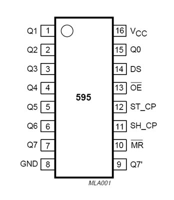
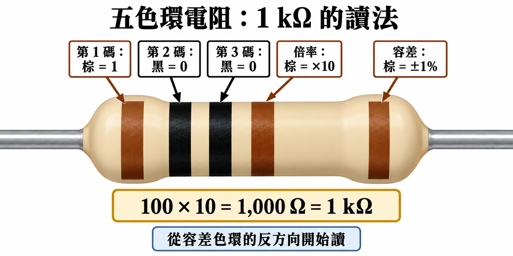
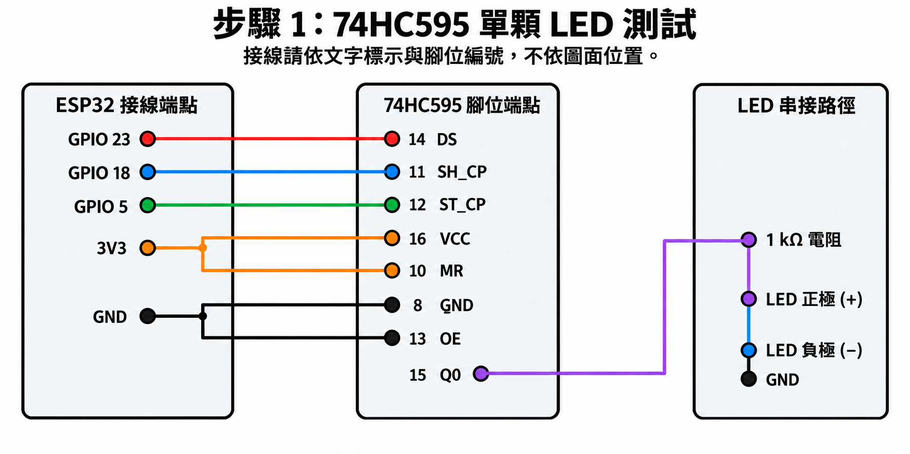
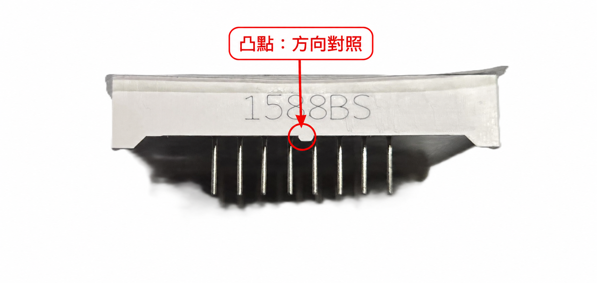
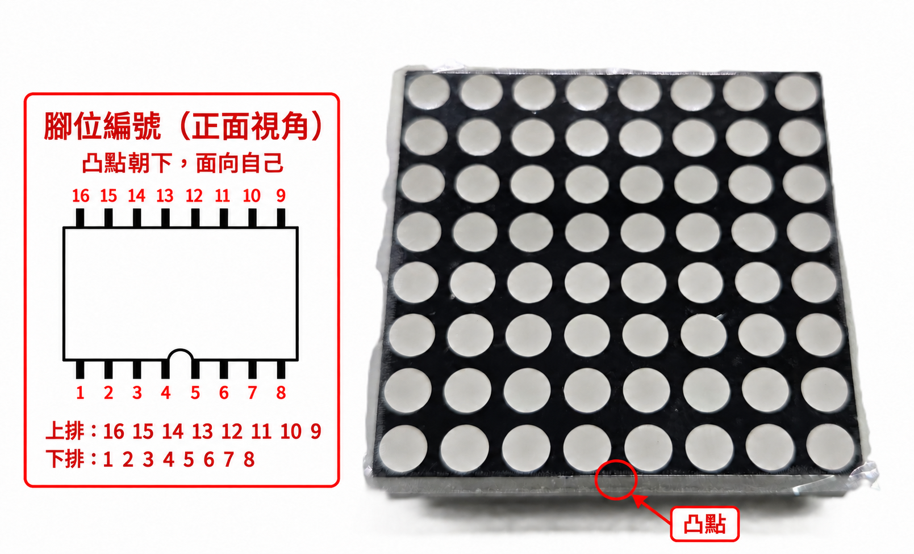
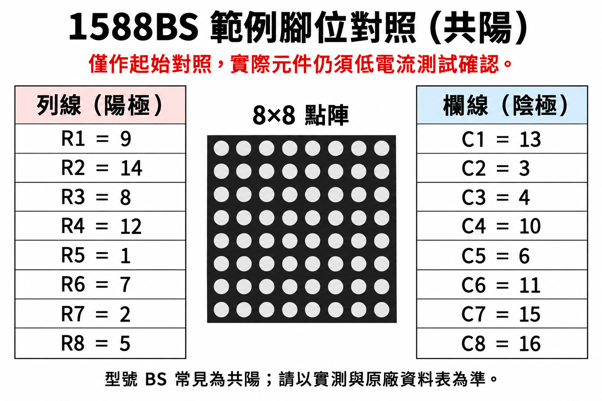
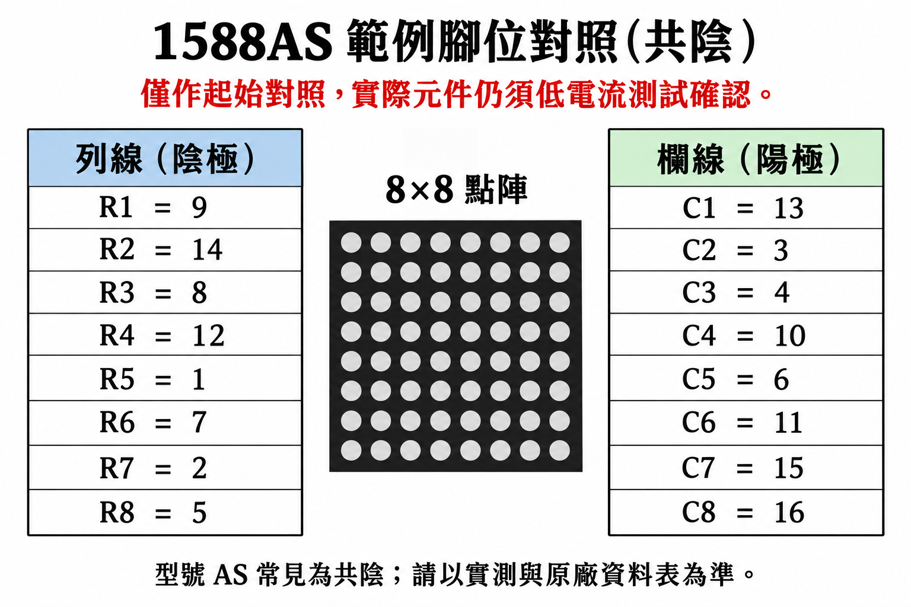
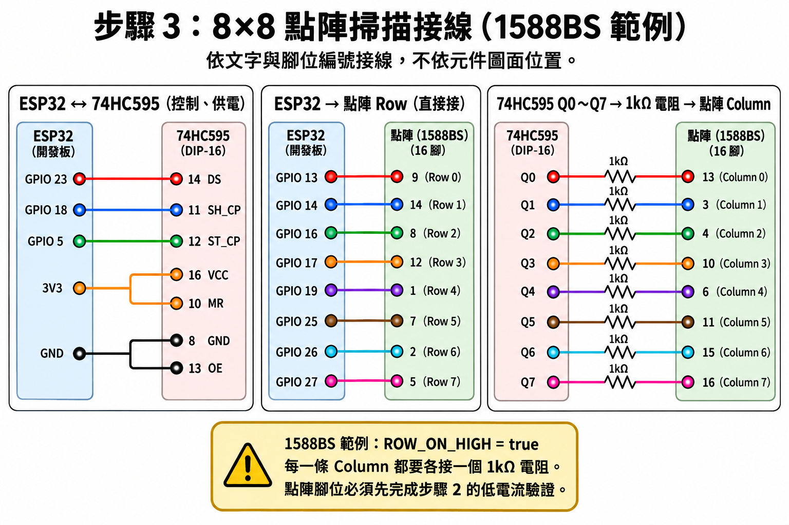

# 74HC595：辨識並驅動裸 8×8 點陣

這一頁使用 74HC595 擴充 ESP32 的輸出腳位，並以逐列掃描方式顯示 8×8 圖樣。套件中的點陣是裸元件，腳位與極性可能因型號不同而不同；因此先完成安全的辨識與單點測試，再接入掃描程式。

## 你會學到什麼

- 說出 74HC595 的 data、clock、latch 三條控制線的作用。
- 用 74HC595 控制一顆 LED，確認移位與鎖存流程。
- 以低電流測試辨識裸 8×8 點陣的列、欄與正負極性。
- 用逐列掃描顯示固定 8×8 圖樣，並調整反相或鏡像問題。

## 開始前

| 項目 | 需求 |
| --- | --- |
| 前置教材 | [課程準備：認識 AIoT 資料流](02-課程準備.md) |
| 必做硬體 | ESP32、74HC595N、裸 8×8 點陣、麵包板、杜邦線、散裝 LED、`1kΩ` 電阻 |
| 不使用的元件 | MAX7219 模組不在本課材料套件中；只在文末作額外補充 |
| 已保留的腳位 | DHT11：GPIO 4；LCD I2C：GPIO 21、22；板載 LED：GPIO 2 |

!!! warning "先斷電、確認缺口方向"
    接線前先拔掉 ESP32 USB。74HC595 的缺口朝上時，左上角是第 1 腳，腳位以逆時針方向編號。插反 IC 或省略限流電阻，都可能損壞元件。

!!! warning "本節使用低亮度、安全優先的掃描方式"
    每個由 74HC595 接往點陣的欄線都要串接一個 `1kΩ` 電阻。這會讓畫面較暗，但可降低同一列多顆 LED 同時點亮時的電流。不要為了更亮自行改用更低阻值或移除電阻；高亮度、長時間展示需要額外驅動電路，不是本課必做內容。

## 成功的樣子

完成後，裸點陣會穩定顯示一個愛心圖樣：

```text
.XX..XX.
XXXXXXXX
XXXXXXXX
.XXXXXX.
..XXXX..
...XX...
........
........
```

點陣實際亮起的顏色與圖樣方向可能不同；只要能依你的腳位紀錄修正成可辨識圖樣，即為成功。

## 74HC595 的核心腳位

{ width="360" }
> 74HC595 DIP-16 腳位圖；缺口朝上時，左上角是第 1 腳。

圖中的上橫線表示「低有效」：`OE` 必須是 LOW 才會輸出，`MR` 是 LOW 時會清除移位資料。

| 74HC595 腳位 | 名稱 | 本節接法／作用 |
| ---: | --- | --- |
| 8 | GND | 接 ESP32 `GND` |
| 16 | VCC | 接 ESP32 `3V3` |
| 14 | `DS` | 序列資料，接 GPIO 23 |
| 11 | `SH_CP` | 時脈，接 GPIO 18 |
| 12 | `ST_CP` | 鎖存，接 GPIO 5 |
| 13 | `OE` | 低電位才輸出，接 `GND` |
| 10 | `MR` | 低電位會清除資料，接 `3V3` |
| 15、1～7 | `Q0`～`Q7` | 八條平行輸出 |
| 9 | `Q7'` | 串接下一顆 74HC595 時才使用；本節不接 |

`DS` 是資料位元進入的位置；每送一個 clock，資料向內移動一格；latch 才把八個位元一起送到 `Q0`～`Q7`。這讓 ESP32 用三條線控制八條輸出。

## 補充：第一次使用電阻，讀五色環 `1kΩ`

電阻的用途是**限制電流**。本節把 `1kΩ` 電阻串在 74HC595 與 LED／點陣之間，避免 LED 與 GPIO／74HC595 因電流過大而受損。電阻沒有正負極，兩端任一方向接入都可以；但阻值必須正確。

本課材料中的軸向電阻採五色環。讀取方式是：前三環為有效數字，第 4 環為倍率，第 5 環為容差。容差環通常與前四環距離較遠，因此從容差環的**反方向**開始讀。



本節要找的 `1kΩ` 電阻色環是：

```text
棕　黑　黑　棕　棕
1   0   0   ×10  ±1%
```

計算為 `100 × 10 = 1,000Ω = 1kΩ`。常用數字色碼如下：

| 顏色 | 黑 | 棕 | 紅 | 橙 | 黃 | 綠 | 藍 | 紫 | 灰 | 白 |
| --- | ---: | ---: | ---: | ---: | ---: | ---: | ---: | ---: | ---: | ---: |
| 數字 | 0 | 1 | 2 | 3 | 4 | 5 | 6 | 7 | 8 | 9 |

!!! tip "顏色不確定時"
    光線、老化或色覺差異都可能讓棕、紅、橙等顏色難以分辨。不要靠猜測改接；請教師用萬用表協助量測，或依材料袋上的標示確認。本節所有標示 `1kΩ` 的位置都使用相同阻值。

## 步驟 1：先用一顆 LED 測試 74HC595

**目的：** 在接裸點陣前，先確認 IC 方向、data、clock、latch 與輸出 `Q0` 都正常。

除了上表的 ESP32 與 74HC595 接線外，將 `Q0`（第 15 腳）依下表接上一顆散裝 LED。

| 元件端 | 連到哪裡 |
| --- | --- |
| 74HC595 `Q0`（第 15 腳） | `1kΩ` 電阻 |
| `1kΩ` 電阻另一端 | LED 長腳（正極） |
| LED 短腳（負極） | `GND` |



這是**端點式原理接線圖**，不是 ESP32 與 IC 在麵包板上的實際位置圖。接線時一律以文字標示的 GPIO、74HC595 腳位編號與 LED 正負極為準；不要依元件在圖片中的相對位置插線。`OE`（第 13 腳）接 GND 才會啟用輸出，`MR`（第 10 腳）接 3V3 才不會清除資料。

建立檔案 `shift_register_led.ino`。

執行位置：Arduino IDE／ESP32  
檔案：`shift_register_led.ino`

```cpp
const int DATA_PIN = 23;
const int CLOCK_PIN = 18;
const int LATCH_PIN = 5;

void writeRegister(byte value) {
  digitalWrite(LATCH_PIN, LOW);
  shiftOut(DATA_PIN, CLOCK_PIN, MSBFIRST, value);
  digitalWrite(LATCH_PIN, HIGH);
}

void setup() {
  pinMode(DATA_PIN, OUTPUT);
  pinMode(CLOCK_PIN, OUTPUT);
  pinMode(LATCH_PIN, OUTPUT);
}

void loop() {
  writeRegister(B00000001);  // Q0 輸出 HIGH
  delay(500);

  writeRegister(B00000000);  // 所有輸出 LOW
  delay(500);
}
```

預期結果：接在 `Q0` 的 LED 每半秒亮、滅一次。

!!! tip "LED 沒有亮時"
    先將 LED 翻轉方向，再檢查 IC 缺口、`OE` 是否接 GND、`MR` 是否接 3V3，以及 `Q0` 是否真的接第 15 腳。不要先接上裸點陣。

## 步驟 2：辨識裸 8×8 點陣的極性與腳位

**目的：** 建立屬於這一片點陣的接線紀錄，不靠猜測或直接照用其他型號的腳位圖。

裸點陣通常有 16 個腳位，分成兩組各 8 條線。任一顆 LED 都位在「一條列線」與「一條欄線」之間，但不同型號的實體腳位順序不相同。

### 實物方向與腳位編號

先看外殼中央的凸點，再進行任何腳位判讀。這個方向基準可避免把元件前後翻轉後，仍以同一組腳位編號接線。



以照片的正面視角拿著元件，讓凸點所在的下緣朝向自己。此時腳位編號如下：上排由左至右為 `16` 到 `9`，下排由左至右為 `1` 到 `8`。正面 64 個圓點是 LED，**不是腳位**。



> 此圖對應本課使用的 16-pin `1588BS` 外型。腳位功能（Row、Column 與正負極）仍以後面的低電流測試為準；不要只依外觀推定極性。

#### 讀取型號與極性

先查看點陣正面或側面的印字，記下完整型號與額外字母，例如 `1588BS`。`1588` 常用於 16-pin、8×8 裸點陣系列；後綴字母常用來區分極性：

| 印字範例 | 常見極性 | 本頁程式的起始設定 |
| --- | --- | --- |
| `1588BS` | 共陽：列線為陽極、欄線為陰極 | `ROW_ON_HIGH = true` |
| `1588AS` | 共陰：列線為陰極、欄線為陽極 | `ROW_ON_HIGH = false` |

如果你手邊元件標示為 `1588BS`，可先從下方 BS 圖開始測試。後綴是供應商常見的命名方式，**不是跨所有廠牌都保證相同的標準**；若腳位數不是 16、印字不同，或測試結果不符，就回到低電流測試，不可以直接套用。

下列兩圖是常見的 16-pin 對照範例。它們是「腳位編號對照表」，**不是實體腳位位置圖**；請以元件本體的編號、實測結果與原廠資料表為準。





若要先驗證 `1588BS` 的範例，從候選腳位組 `R1 = 9`、`C1 = 13` 開始：`3V3 → 1kΩ → 第 9 腳`，再將第 13 腳接 `GND`。若是 `1588AS`，則反過來：`3V3 → 1kΩ → 第 13 腳`，第 9 腳接 `GND`。有一個像素亮起後，再繼續記錄其他列與欄；這個亮點的實體位置也可能因廠牌而不同。

### 低電流單點測試接法

先確認裸點陣**尚未接到任何 ESP32 GPIO**，再接回 ESP32 USB，僅使用 ESP32 的 `3V3` 與 `GND` 腳作為低電流測試電源。依序接：

```text
3V3 ── 1kΩ 電阻 ── 點陣候選腳 A
GND ───────────────── 點陣候選腳 B
```

1. 任選兩隻點陣腳 A、B；每次都必須保留 `1kΩ` 電阻。
2. 如果有一個像素亮起，記錄「A 接正極、B 接 GND」與像素位置。
3. 若沒有亮，先交換 A、B 的正負方向再試；仍不亮才換下一對腳位。
4. 重複測試並整理兩組各八條線。能對應到同一排八個像素的一組，可命名為列；另一組命名為欄。

請在紙上或自己的專案資料夾建立這張紀錄表；以下只提供格式，不可直接填入假設的腳位：

| 邏輯名稱 | 點陣實際腳位 | 備註 |
| --- | --- | --- |
| Row 0（最上列） |  |  |
| Row 1 |  |  |
| Row 2 |  |  |
| Row 3 |  |  |
| Row 4 |  |  |
| Row 5 |  |  |
| Row 6 |  |  |
| Row 7（最下列） |  |  |
| Column 0（最左欄） |  |  |
| Column 1 |  |  |
| Column 2 |  |  |
| Column 3 |  |  |
| Column 4 |  |  |
| Column 5 |  |  |
| Column 6 |  |  |
| Column 7（最右欄） |  |  |

判讀極性：如果測試時「列線接正極、欄線接 GND」才亮，這組設定可使用 `ROW_ON_HIGH = true`；反過來則使用 `ROW_ON_HIGH = false`。程式會依此自動設定欄線的反向電位。

!!! warning "10 分鐘無法辨識時先停下"
    不要反覆猜接或同時接很多點陣腳。請教師或助教提供該批點陣已驗證的腳位表；本節的重點是依紀錄設定程式，而不是徒手窮舉所有接線組合。

## 步驟 3：接線並顯示掃描圖樣

**目的：** 讓 ESP32 依序啟用一列，74HC595 同時設定該列的八個欄位，利用視覺暫留形成完整圖樣。

### 列與欄的接線原則

1. 將點陣的八條 **Row** 線接到 ESP32：GPIO 13、14、16、17、19、25、26、27。接線順序必須對應步驟 2 記錄的 `Row 0` 到 `Row 7`。
2. 將 74HC595 的 `Q0`～`Q7` 分別經過八個 `1kΩ` 電阻，接到點陣的八條 **Column** 線。順序必須對應 `Column 0` 到 `Column 7`。
3. ESP32、74HC595 與點陣使用同一個 `GND`。

若你已用上述測試確認點陣符合 `1588BS`／`1588AS` 的範例對照，可採以下順序接到本頁程式：

| 程式邏輯線 | 點陣候選腳位 |
| --- | --- |
| ESP32 `ROW_PINS[0]` 到 `ROW_PINS[7]` | 9、14、8、12、1、7、2、5 |
| 74HC595 `Q0` 到 `Q7`（每一路都經 `1kΩ`） | 13、3、4、10、6、11、15、16 |



`1588BS` 使用 `ROW_ON_HIGH = true`；`1588AS` 使用 `ROW_ON_HIGH = false`。這只適用於已確認與範例一致的元件；若圖樣鏡像、反相或無法點亮，請停止猜接並回到步驟 2 的實測紀錄。

!!! note "接線組可交換，但程式設定必須一起調整"
    若你的實測結果顯示較適合由 ESP32 控制欄、74HC595 控制列，也可以交換兩組角色；但這份核心程式預設「ESP32 控制列、74HC595 控制欄」。第一次操作請依本頁原則接線，較容易排錯。

建立檔案 `matrix_heart.ino`。上傳前，先根據步驟 2 的極性設定 `ROW_ON_HIGH`；其餘 GPIO 不要任意更改。

執行位置：Arduino IDE／ESP32  
檔案：`matrix_heart.ino`

```cpp
const int DATA_PIN = 23;
const int CLOCK_PIN = 18;
const int LATCH_PIN = 5;

const int ROW_PINS[8] = {13, 14, 16, 17, 19, 25, 26, 27};

// 步驟 2：列線接正極才亮，填 true；列線接 GND 才亮，填 false。
const bool ROW_ON_HIGH = true;

// 每一個 byte 是一列；由左到右依序是 bit 7 到 bit 0。
const byte HEART[8] = {
  B00000000,
  B01100110,
  B11111111,
  B11111111,
  B01111110,
  B00111100,
  B00011000,
  B00000000,
};

void writeColumns(byte pixels) {
  byte outputs = 0;

  for (int column = 0; column < 8; column++) {
    bool pixel_on = pixels & (B10000000 >> column);
    bool column_on_high = !ROW_ON_HIGH;

    if (pixel_on == column_on_high) {
      outputs |= (B00000001 << column);
    }
  }

  digitalWrite(LATCH_PIN, LOW);
  shiftOut(DATA_PIN, CLOCK_PIN, MSBFIRST, outputs);
  digitalWrite(LATCH_PIN, HIGH);
}

void allRowsOff() {
  int row_off_level = ROW_ON_HIGH ? LOW : HIGH;

  for (int row = 0; row < 8; row++) {
    digitalWrite(ROW_PINS[row], row_off_level);
  }
}

void scanFrame(const byte frame[8]) {
  int row_on_level = ROW_ON_HIGH ? HIGH : LOW;

  for (int row = 0; row < 8; row++) {
    allRowsOff();
    writeColumns(frame[row]);
    digitalWrite(ROW_PINS[row], row_on_level);
    delayMicroseconds(900);
  }

  allRowsOff();
}

void setup() {
  pinMode(DATA_PIN, OUTPUT);
  pinMode(CLOCK_PIN, OUTPUT);
  pinMode(LATCH_PIN, OUTPUT);

  for (int row = 0; row < 8; row++) {
    pinMode(ROW_PINS[row], OUTPUT);
  }

  allRowsOff();
  writeColumns(B00000000);
}

void loop() {
  scanFrame(HEART);
}
```

預期結果：點陣持續顯示愛心，肉眼看起來不會逐列閃爍。

`scanFrame()` 每次只點亮一列，再快速換到下一列；`loop()` 不停重複掃描，所以眼睛會把八列看成同一個完整圖樣。

## 小練習：修改一列圖樣資料

**目標：** 讓愛心最下方多亮一個像素。

請在 `# TODO` 處補上第 6 列的位元資料。其餘程式不用修改。

執行位置：Arduino IDE／ESP32  
檔案：`practice_matrix_row.ino`

```cpp linenums="1" hl_lines="7"
const byte HEART[8] = {
  B00000000,
  B01100110,
  B11111111,
  B11111111,
  B01111110,
  // TODO: 將這一列改為 .XX.....，由左至右以 bit 7 到 bit 0 表示
  B00011000,
  B00000000,
  B00000000,
};
```

預期結果：第 6 列顯示 `.XX.....`，也就是左邊數起第 2、3 個像素亮起。

<details>
<summary>查看參考解答</summary>

```cpp
B01100000,
```

從左至右使用 bit 7 到 bit 0，`.XX.....` 對應 `0 1 1 0 0 0 0 0`，所以是 `B01100000`。
</details>

## 完成時，應能確認

- 74HC595 的 `Q0` 能讓一顆外接 LED 亮、滅。
- 你已記錄自己的裸點陣列線、欄線與極性；沒有直接猜用其他型號腳位圖。
- 八條點陣欄線都各有一個 `1kΩ` 限流電阻。
- 點陣能以逐列掃描顯示可辨識的固定圖樣。
- 遇到反相、鏡像或閃爍時，知道要檢查極性、列欄對照、位元順序與掃描時間。

## 常見問題

### 74HC595 測試 LED 完全不亮

1. 確認 IC 缺口方向；第 16 腳是 `3V3`，第 8 腳是 `GND`。
2. 確認 `OE`（第 13 腳）接 GND，`MR`（第 10 腳）接 3V3。
3. 確認 LED 長腳經過 `1kΩ` 接 `Q0`（第 15 腳），短腳接 GND。
4. 確認晶片標示為 `74HC595`；若是不同型號，先請教師確認工作電壓與腳位。

### 點陣全暗

1. 回到步驟 1，先確認 74HC595 的單顆 LED 測試成功。
2. 確認所有八個 `1kΩ` 電阻都在 74HC595 與點陣之間，沒有漏接。
3. 將 `ROW_ON_HIGH` 改成另一個值後重新上傳。
4. 回到步驟 2，確認 Row 與 Column 的實測紀錄沒有對調。

### 圖樣左右鏡像、上下顛倒或位置錯誤

這不是感測器或 Python 的問題，而是列欄的實體接線順序與程式邏輯順序不同。先在紙上比對 `Row 0`、`Column 0` 對應的位置；需要時交換對應的兩條線，或調整 `HEART` 中列資料的順序。每次只改一項，再觀察結果。

### 圖樣很暗、閃爍或出現鬼影

1. 確認 `loop()` 內只有 `scanFrame(HEART);`，沒有額外的長時間 `delay()`。
2. 確認程式在改寫欄資料前先呼叫 `allRowsOff()`；這可減少換列瞬間的鬼影。
3. 不要移除 `1kΩ` 電阻或直接提高電流。若需要高亮度、長時間顯示，必須改用額外驅動電路，請先與教師確認。

## 額外補充：若使用的是 MAX7219 點陣模組

MAX7219 模組已內建掃描與限流驅動，接線通常是 `VCC`、`GND`、`DIN`、`CLK`、`CS`；程式不需要自行逐列掃描。它**不在本課材料套件中，不能取代上面的裸點陣必做流程**。

若日後取得 MAX7219 模組，可在 Arduino IDE 安裝 `LedControl` 函式庫，以下程式展示概念：

```cpp
#include <LedControl.h>

LedControl matrix(23, 18, 5, 1);  // DIN, CLK, CS, 模組數量

void setup() {
  matrix.shutdown(0, false);
  matrix.setIntensity(0, 3);
  matrix.clearDisplay(0);
  matrix.setRow(0, 0, B01100110);
}

void loop() {
}
```

此程式只適用於已含 MAX7219 的模組；不能把裸 8×8 點陣直接接上後使用。

## 重點整理

- 74HC595 用 data、clock、latch 三條控制線，換取八條平行輸出。
- 裸 8×8 點陣的腳位與極性必須先以低電流實測並記錄。
- 74HC595 到點陣的每條欄線都必須串接 `1kΩ` 限流電阻。
- 逐列掃描的重點是：先關閉所有列、設定欄資料、只啟用一列，快速重複。
- MAX7219 是含驅動器的額外模組，使用方式與裸點陣不同。

## 延伸練習（可選）

將愛心圖樣改為一個向右箭頭，或設計一個代表「溫度偏高」的圖示。先用 8 行由 `.` 與 `X` 組成的文字畫出圖案，再把每一行轉成 8-bit 二進位資料。

## 延伸閱讀

想理解位元、極性與逐列掃描的程式順序，可閱讀[延伸選讀：74HC595 與裸 8×8 點陣掃描導讀](附錄-74HC595與8x8點陣掃描導讀.md)。

## 下一步

[Gradio：建立本機 AIoT 儀表板](07-gradio-aiot儀表板.md)：以 Python 的 Gradio 建立本機 AIoT 儀表板，顯示 DHT11 資料並透過 UART 控制 ESP32。
