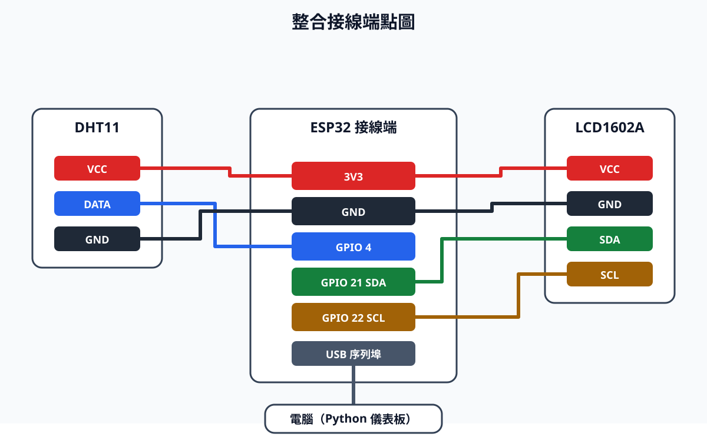

# 整合專題：完成環境看板

這一頁把前面做過的功能放在一起，完成一個環境看板。你會先讓 ESP32 讀取 DHT11，再依序完成 LCD 或點陣顯示、資料記錄、圖表和 Gradio 網頁控制。

## 你會學到什麼

- 依順序整合 ESP32 程式與 Python 程式。
- 用一份 ESP32 程式讀 DHT11、更新 LCD、傳送資料和控制 LED。
- 正確安排 CSV、圖表與 Gradio，避免 COM 埠被兩支程式同時使用。
- 用測試結果說明你的專題已經完成。

## 開始前

| 項目 | 需求 |
| --- | --- |
| 前置教材 | 已完成 [UART](03-uart-python-esp32.md)、[感測資料視覺化](04-python-感測資料視覺化.md)、[LCD](05-i2c-lcd.md) 或 [裸 8×8 點陣](06-74hc595-8x8點陣.md)、[Gradio 儀表板](07-gradio-aiot儀表板.md) |
| 核心硬體 | ESP32、USB 資料線、DHT11、以及 LCD1602A 或已驗證的裸 8×8 點陣 |
| Python 套件 | `pyserial`、`pandas`、`matplotlib`、`gradio` |
| Arduino 函式庫 | `DHT sensor library`、`Adafruit Unified Sensor`；使用 LCD 路徑時另需 `LiquidCrystal I2C` |
| 已知資訊 | ESP32 COM 埠、LCD I2C 掃描位址（若使用 LCD） |

!!! warning "先備份成功版本"
    先複製前面能成功執行的 `.ino` 和 `.py` 檔。整合出問題時，才能回到已知可用的版本檢查；不要覆蓋唯一一份成功程式。

!!! warning "同一個 COM 埠一次只能給一支程式使用"
    `record_sensor_data.py`、`read_uart.py` 和 `gradio_dashboard.py` 都要連 ESP32。先完成資料記錄並讓程式結束，再畫圖，最後才開 Gradio。使用 Python 前也要關閉 Arduino 序列監控。

## 這一節要完成什麼

| 類型 | 要做的事 | 你會看到什麼 |
| --- | --- | --- |
| 核心 | DHT11 → ESP32 → USB UART | Python 能讀到溫度和濕度 |
| 核心 | CSV 與 Matplotlib | 有至少 10 筆資料與一張可判讀的圖 |
| 核心 | LCD1602A **或**裸 8×8 點陣 | 至少一種顯示器呈現可辨識資訊或圖樣 |
| 核心 | localhost Gradio 與 LED 控制 | 頁面顯示資料，且 ESP32 回覆 LED 狀態 |

整體架構如下。先完成 ESP32 到 USB UART，再完成 Python 的資料記錄、圖表和 Gradio。

```text
                 ┌── I2C ──> LCD1602A（核心範例）
DHT11 → ESP32 ──┤
                 ├── 同步序列 ──> 74HC595 + 裸 8×8 點陣（替代顯示路徑）
                 │
                 └── USB UART ──> Python：CSV → Matplotlib 圖
                                        └──> Gradio localhost → LED 命令
```

## 成功的樣子

完成後，你應該能找到下列成果：

```text
Arduino IDE／LCD：T:25.0 C、H:60.0 %
CSV：data/sensor.csv 至少 10 筆資料
圖表：charts/temperature_humidity.png
Gradio：最新讀值、最近資料表／折線圖、LED 開關回覆
```

你不需要讓 LCD 和裸 8×8 點陣同時運作，選其中一種顯示器即可。這份範例使用 LCD；若你選裸點陣，先保留[前一頁](06-74hc595-8x8點陣.md)已驗證的列、欄與極性設定，再加入 UART。不要重新猜點陣腳位。

## 步驟 1：建立整合前的測試順序

**目的：** 先確認每個小功能都能運作，再把它們合在一起。

請照順序測試。前一項成功後才做下一項；某一項失敗，就先回到對應教材處理。

| 順序 | 先測什麼 | 成功時會看到什麼 | 失敗時先回到 |
| ---: | --- | --- | --- |
| 1 | DHT11 最小讀值 | 序列監控出現有效溫溼度 | [UART 教材](03-uart-python-esp32.md) 的 DHT11 接線 |
| 2 | LCD 固定文字與位址 | 掃描到 `0x27`／`0x3F`，LCD 可顯示文字 | [LCD 教材](05-i2c-lcd.md) 步驟 1、2 |
| 3 | 整合 ESP32 韌體 | LCD 顯示讀值且傳送 `sensor` JSON | 本頁步驟 2 |
| 4 | CSV 資料 | `data/sensor.csv` 有至少 10 筆 | [視覺化教材](04-python-感測資料視覺化.md) 步驟 1 |
| 5 | 圖表 | `charts/temperature_humidity.png` 已建立 | [視覺化教材](04-python-感測資料視覺化.md) 步驟 3 |
| 6 | Gradio 與 LED | localhost 顯示資料，LED 收到狀態回覆 | [Gradio 教材](07-gradio-aiot儀表板.md) |

## 步驟 2：上傳 DHT11、LCD、UART 與 LED 的整合韌體

**目的：** ESP32 每約 2 秒讀一次 DHT11，同時更新 LCD 並把資料傳給電腦；電腦也可以隨時控制板載 LED。

這個範例使用 LCD。接線和前面相同，不要新增 GPIO：DHT11 DATA 接 GPIO 4、LCD SDA／SCL 接 GPIO 21／22、板載 LED 使用 GPIO 2。先看 I2C 掃描結果，再把 `LCD_ADDRESS` 改成 LCD 的實際位址。



| 元件端 | ESP32 端 | 用途／注意事項 |
| --- | --- | --- |
| DHT11 VCC | 3V3 | DHT11 使用 3.3V 供電 |
| DHT11 GND | GND | 必須和 ESP32、LCD 共地 |
| DHT11 DATA | GPIO 4 | 讀取溫溼度 |
| LCD VCC | 3V3 | 核心範例使用 3.3V，避免 I2C 訊號被拉到 5V |
| LCD GND | GND | 必須共地 |
| LCD SDA | GPIO 21 | I2C 資料線 |
| LCD SCL | GPIO 22 | I2C 時脈線 |
| ESP32 USB | 電腦 USB | 供電、燒錄和 UART 通訊 |
| 板載 LED | GPIO 2 | 不需外接 LED 或杜邦線 |

!!! warning "接線前先拔除 USB"
    改接線時先拔掉 USB。接好後再接回電腦。LCD 的 VCC、SDA 和 SCL 不要直接接到 5V；若 LCD 只能在 5V 下運作，請回到 LCD 教材閱讀雙向 I2C 電平轉換的額外補充。

執行位置：Arduino IDE／ESP32  
檔案：`integrated_lcd_uart.ino`

```cpp
#include <Wire.h>
#include <LiquidCrystal_I2C.h>
#include <DHT.h>

const int DHT_PIN = 4;
const int LED_PIN = 2;
const int SDA_PIN = 21;
const int SCL_PIN = 22;
const byte LCD_ADDRESS = 0x27;  // 改成 I2C 掃描結果
const unsigned long SENSOR_INTERVAL_MS = 2000;

#define DHT_TYPE DHT11

LiquidCrystal_I2C lcd(LCD_ADDRESS, 16, 2);
DHT dht(DHT_PIN, DHT_TYPE);

unsigned long last_sensor_time = 0;
String command_buffer = "";

void readAndSendSensor(const char *source);

void printLine(int row, String text) {
  lcd.setCursor(0, row);
  lcd.print("                ");
  lcd.setCursor(0, row);
  lcd.print(text.substring(0, 16));
}

void sendLedStatus(bool is_on) {
  Serial.printf(
    "{\"type\":\"status\",\"led\":%s,\"ok\":true}\n",
    is_on ? "true" : "false"
  );
}

void handleCommand(String command) {
  command.trim();

  if (command == "{\"cmd\":\"led\",\"value\":true}") {
    digitalWrite(LED_PIN, HIGH);
    sendLedStatus(true);
  } else if (command == "{\"cmd\":\"led\",\"value\":false}") {
    digitalWrite(LED_PIN, LOW);
    sendLedStatus(false);
  } else if (command == "{\"cmd\":\"read_now\"}") {
    readAndSendSensor("request");
  } else if (command.length() > 0) {
    Serial.println("{\"type\":\"error\",\"message\":\"unknown command\"}");
  }
}

void readSerialCommands() {
  while (Serial.available()) {
    char received = static_cast<char>(Serial.read());

    if (received == '\n') {
      handleCommand(command_buffer);
      command_buffer = "";
    } else if (received != '\r') {
      command_buffer += received;
    }
  }
}

void readAndSendSensor(const char *source) {
  float humidity = dht.readHumidity();
  float temperature = dht.readTemperature();

  if (isnan(humidity) || isnan(temperature)) {
    printLine(0, "DHT read failed");
    printLine(1, "Check wiring");
    Serial.printf(
      "{\"type\":\"error\",\"source\":\"%s\",\"message\":\"dht read failed\"}\n",
      source
    );
    return;
  }

  printLine(0, "T:" + String(temperature, 1) + " C");
  printLine(1, "H:" + String(humidity, 1) + " %");
  Serial.printf(
    "{\"type\":\"sensor\",\"source\":\"%s\",\"temp\":%.1f,\"humidity\":%.1f}\n",
    source,
    temperature,
    humidity
  );
}

void setup() {
  Serial.begin(115200);
  pinMode(LED_PIN, OUTPUT);
  digitalWrite(LED_PIN, LOW);

  Wire.begin(SDA_PIN, SCL_PIN);
  lcd.init();
  lcd.backlight();
  printLine(0, "AIoT dashboard");
  printLine(1, "Starting...");

  dht.begin();
}

void loop() {
  readSerialCommands();

  if (millis() - last_sensor_time >= SENSOR_INTERVAL_MS) {
    last_sensor_time = millis();
    readAndSendSensor("periodic");
  }
}
```

上傳後，暫時開啟 Arduino IDE 序列監控，baud rate 設為 `115200`。每約 2 秒，LCD 會更新一次，序列監控也會出現一筆資料：

```json
{"type":"sensor","source":"periodic","temp":25.0,"humidity":60.0}
```

確認後，**關閉序列監控視窗**，讓下一步的 Python 可以使用 COM 埠。

!!! note "為什麼使用 `millis()`？"
    程式等待下一次讀取 DHT11 時，仍能持續檢查電腦送來的命令。因此按 Gradio 的 LED 按鈕後，不必等 2 秒才有反應。

!!! note "按「讀取並記錄資料」時會讀到哪一筆？"
    ESP32 仍會每約 2 秒送出一筆 `source: "periodic"` 資料，方便用序列監控觀察。Gradio 按鈕不會直接拿下一行資料，而是先丟掉已累積的資料、送出 `read_now`，只接受 ESP32 回覆的 `source: "request"`。因此不會把按下按鈕前留在緩衝區的資料寫進 CSV。

### 使用裸 8×8 點陣作為替代顯示器

若你選裸 8×8 點陣，請沿用第 6 份教材已成功的 `ROW_PINS`、`ROW_ON_HIGH`、`writeColumns()` 與 `scanFrame()`。DHT11、UART 和 LED 的部分可沿用本頁做法。不過，點陣還沒單獨成功前，不要同時修改點陣腳位、極性和 UART 命令。

建議順序是：先讓點陣顯示固定圖樣；再加入 `readSerialCommands()`；最後才加入 DHT11 與定時傳送 JSON。任何一步失敗，就回到前一個成功版本。

## 步驟 3：建立真正整合的 Python 儀表板

**目的：** 用**一支** Python 程式完成 UART 讀取、CSV 記錄、Matplotlib 圖表、Gradio 畫面和 LED 控制。

前幾節的 Python 程式是分開練習不同技能；這一步才把它們接起來。每按一次「讀取並記錄資料」，程式會依序做四件事：

```text
要求一筆最新 UART JSON → 寫入 data/sensor.csv → 更新 charts/temperature_humidity.png → 更新 Gradio
```

其中「要求」代表程式會送出 `{"cmd":"read_now"}`，不是從序列埠緩衝區隨意拿下一筆資料。這個請求仍受 DHT11 的量測速度限制，但回覆一定是按鈕按下後由 ESP32 處理的資料。

建立檔案 `integrated_dashboard.py`。只修改 `PORT`；這支程式執行時，不要再開啟 `record_sensor_data.py`、`plot_sensor_data.py` 或 `gradio_dashboard.py`。

執行位置：Python／電腦  
檔案：`integrated_dashboard.py`

```python
import csv
import json
import time
from datetime import datetime
from pathlib import Path

import gradio as gr
import matplotlib.pyplot as plt
import pandas as pd
import serial

PORT = "COM3"  # 改成你的 ESP32 COM 埠
BAUD_RATE = 115200
CSV_PATH = Path("data/sensor.csv")
CHART_PATH = Path("charts/temperature_humidity.png")


class IntegratedDashboard:
    def __init__(self):
        self.ser = serial.Serial(PORT, BAUD_RATE, timeout=0.5)
        time.sleep(2)
        self.ser.reset_input_buffer()

    def close(self):
        if self.ser.is_open:
            self.ser.close()

    def read_json(self):
        raw = self.ser.readline().decode("utf-8", errors="replace").strip()
        if not raw:
            return None
        try:
            return json.loads(raw)
        except json.JSONDecodeError:
            return None

    def read_sensor(self):
        # 捨棄按下按鈕前累積的定時資料，再要求 ESP32 立即讀值。
        self.ser.reset_input_buffer()
        message = json.dumps({"cmd": "read_now"}, separators=(",", ":")) + "\n"
        self.ser.write(message.encode("utf-8"))
        self.ser.flush()

        deadline = time.monotonic() + 4
        while time.monotonic() < deadline:
            data = self.read_json()
            if data and data.get("type") == "sensor" and data.get("source") == "request":
                return {
                    "timestamp": datetime.now().isoformat(timespec="seconds"),
                    "temp_c": float(data["temp"]),
                    "humidity": float(data["humidity"]),
                }, None
            if data and data.get("type") == "error" and data.get("source") == "request":
                return None, data.get("message", "ESP32 error")
        return None, "4 秒內沒有收到本次讀取的 sensor JSON"

    def append_csv(self, row):
        CSV_PATH.parent.mkdir(exist_ok=True)
        is_new = not CSV_PATH.exists()
        with CSV_PATH.open("a", newline="", encoding="utf-8") as file:
            writer = csv.DictWriter(file, fieldnames=["timestamp", "temp_c", "humidity"])
            if is_new:
                writer.writeheader()
            writer.writerow(row)

    def dataframe_and_chart(self):
        data = pd.read_csv(CSV_PATH)
        data["timestamp"] = pd.to_datetime(data["timestamp"], errors="coerce")
        data["temp_c"] = pd.to_numeric(data["temp_c"], errors="coerce")
        data["humidity"] = pd.to_numeric(data["humidity"], errors="coerce")
        data = data.dropna().tail(20)

        fig, (temp_ax, humidity_ax) = plt.subplots(2, 1, sharex=True, figsize=(8, 5))
        temp_ax.plot(data["timestamp"], data["temp_c"], marker="o", color="tab:red")
        humidity_ax.plot(data["timestamp"], data["humidity"], marker="o", color="tab:blue")
        temp_ax.set_ylabel("Temperature (°C)")
        humidity_ax.set_ylabel("Humidity (%)")
        humidity_ax.set_xlabel("Time")
        temp_ax.grid(True)
        humidity_ax.grid(True)
        fig.autofmt_xdate()
        fig.tight_layout()
        CHART_PATH.parent.mkdir(exist_ok=True)
        fig.savefig(CHART_PATH, dpi=150)
        return data, fig

    def set_led(self, value):
        self.ser.reset_input_buffer()
        message = json.dumps({"cmd": "led", "value": value}, separators=(",", ":")) + "\n"
        self.ser.write(message.encode("utf-8"))
        deadline = time.monotonic() + 5
        while time.monotonic() < deadline:
            data = self.read_json()
            if data and data.get("type") == "status" and data.get("led") == value:
                return "LED 已開啟" if value else "LED 已關閉"
        return "沒有收到 ESP32 的 LED 狀態回覆"


dashboard = IntegratedDashboard()

def refresh():
    row, error = dashboard.read_sensor()
    if error:
        return "—", "—", pd.DataFrame(), None, f"讀取失敗：{error}"
    dashboard.append_csv(row)
    data, figure = dashboard.dataframe_and_chart()
    return f"{row['temp_c']:.1f} °C", f"{row['humidity']:.1f} %", data, figure, "已寫入 CSV 並更新圖表"

with gr.Blocks(title="整合環境看板") as demo:
    gr.Markdown("# 整合環境看板")
    with gr.Row():
        temperature = gr.Textbox(label="最新溫度", value="—")
        humidity = gr.Textbox(label="最新濕度", value="—")
    read_button = gr.Button("讀取並記錄資料", variant="primary")
    table = gr.Dataframe(label="最近 20 筆 CSV 資料", interactive=False)
    chart = gr.Plot(label="溫度與濕度趨勢")
    with gr.Row():
        led_on = gr.Button("LED 開啟")
        led_off = gr.Button("LED 關閉")
    status = gr.Textbox(label="狀態")

    read_button.click(refresh, outputs=[temperature, humidity, table, chart, status])
    led_on.click(lambda: dashboard.set_led(True), outputs=status)
    led_off.click(lambda: dashboard.set_led(False), outputs=status)

try:
    demo.launch(server_name="127.0.0.1", share=False)
finally:
    dashboard.close()
```

執行位置：PowerShell／電腦

```powershell
uv run python integrated_dashboard.py
```

預期結果：開啟 `http://127.0.0.1:7860` 後，按「讀取並記錄資料」；頁面會更新最新溫溼度、資料表和折線圖，同時新增一列 `data/sensor.csv`，並更新 `charts/temperature_humidity.png`。LED 按鈕仍會等待 ESP32 回覆。

!!! warning "這支程式是唯一的 UART 使用者"
    `integrated_dashboard.py` 已經同時完成資料記錄、繪圖和網頁顯示。執行時不要再開啟其他讀取 ESP32 COM 埠的 Python 程式或 Arduino 序列監控。

## 步驟 4：自行檢查成果

**目的：** 用相同方法再測一次，確認每個功能都能正常運作。

| 測試項目 | 怎麼做 | 正常時會看到什麼 | 如何自行確認 |
| --- | --- | --- | --- |
| 感測資料 | 讓整合韌體運作至少 10 秒 | LCD 顯示讀值；UART 有多筆 `sensor` JSON | 看 LCD 與序列監控是否同時更新 |
| 資料紀錄 | 在整合頁面連按「讀取並記錄資料」至少 10 次 | CSV 有表頭與至少 10 筆資料 | 開啟 `data/sensor.csv` 查看 |
| 資料判讀 | 按「讀取並記錄資料」後查看圖表 | 圖表有兩個趨勢、單位、圖例 | 開啟 PNG 圖檔查看 |
| 網頁頁面 | 在 localhost 按「讀取並記錄資料」 | Gradio 的數值、表格與圖表一起新增資料 | 直接查看瀏覽器畫面 |
| LED 命令 | 在整合頁面按 LED 開啟後再關閉 | 板載 LED 行為一致，並有兩次 `status` 回覆 | 查看 LED 與狀態框 |
| 錯誤處理 | 暫時拔除 DHT11 DATA 後再接回 | LCD 與 UART 回報 DHT 讀取錯誤；恢復接線後重新有資料 | 看到錯誤後再確認資料恢復 |

要改接線時，先拔除 USB。最後一列是除錯練習；不確定接線時，觀看教師示範即可，不要反覆猜接腳位。

## 小練習：加入溫度提醒判斷

**目標：** 將最新溫度轉成簡單的提示文字，作為之後在 Gradio 或 LCD 顯示狀態的準備。

請在 `# TODO` 處補上條件式。其餘程式不用修改。

執行位置：Python／電腦  
檔案：`practice_temperature_status.py`

```python linenums="1" hl_lines="4-5"
TEMPERATURE_WARNING = 30.0

def temperature_status(temp_c):
    # TODO: temp_c 大於或等於 TEMPERATURE_WARNING 時回傳 "注意：溫度偏高"
    # TODO: 否則回傳 "溫度正常"
    pass


print(temperature_status(31.2))
```

預期結果：輸出 `注意：溫度偏高`。

<details>
<summary>查看參考解答</summary>

```python
def temperature_status(temp_c):
    if temp_c >= TEMPERATURE_WARNING:
        return "注意：溫度偏高"
    return "溫度正常"
```

將判斷寫成函式，之後才可以讓 LCD、Gradio 或其他介面重複使用相同規則。這個門檻只用於練習，不能單獨判定環境是否真的危險。
</details>

## 完成時，應能確認

- ESP32 每約 2 秒傳送一筆 DHT11 感測資料。
- LCD 或裸 8×8 點陣至少一種能正常顯示。
- CSV 有至少 10 筆資料，並已建立溫度／濕度圖表。
- Gradio 只在 localhost 執行，可以顯示資料和控制 LED。
- 你知道 CSV 記錄程式和 Gradio 不能同時使用同一個 COM 埠。
- 你能說出一項圖表觀察、一項資料限制和一次除錯紀錄。

## 常見問題

### 整合韌體上傳後，LCD 有畫面但 Python 收不到資料

1. 暫時開啟序列監控，確認每約 2 秒有 `sensor` JSON；確認後關閉它。
2. 確認 Python 與 ESP32 都使用 `115200` baud rate。
3. 確認 Python 的 `PORT` 是 ESP32 的 COM 埠，不是其他裝置。

### Python 能收到 JSON，但 LCD 顯示 `DHT read failed`

1. 這通常表示 UART 和 LCD 已經正常。先檢查 DHT11 的 VCC、GND、DATA 與 GPIO 4。
2. 確認沒有把 DHT11 讀取間隔改得比約 2 秒更短。
3. 先回到 DHT11 最小程式；不要同時更換 LCD 位址與 DHT11 接線。

### LCD 掃得到位址，卻無法顯示整合程式的文字

1. 將 `LCD_ADDRESS` 改成掃描結果，不要假定一定是 `0x27`。
2. 確認 LCD 使用 3.3V 與 GPIO 21／22，並依 LCD 教材調整對比。
3. 先上傳 `lcd_hello.ino`；固定文字成功後再回到整合韌體。

### CSV 記錄或 Gradio 顯示 COM 埠被占用

1. 關閉 Arduino 序列監控。
2. 在 PowerShell 停止正在執行的另一個 Python 程式，確認提示字元已回來。
3. 重開啟需要的那一支程式；不要同時執行兩支 UART Python 程式。

### Gradio 的 LED 按鈕顯示逾時

1. 確認整合韌體包含 `readSerialCommands()`，且 `loop()` 每次都會呼叫它。
2. 確認 Python 命令是以換行結尾的 `{"cmd":"led","value":true}` 或 `false`。
3. 先以 UART 教材的最小 LED 控制程式驗證命令與板載 LED 行為。

## 重點整理

- 先分段測試，再把程式整合；保留每一段的成功版本。
- ESP32 負責 DHT11、LCD、UART 資料和 LED；Python 負責 CSV、圖表和 Gradio。
- CSV 記錄和 Gradio 要依序執行，不能同時搶同一個 COM 埠。
- LCD 或裸 8×8 點陣成功一種，就符合本節的顯示器要求。

!!! tip "延伸選讀：完整程式如何協作？"
    已完成本頁實作，想逐行理解 ESP32 韌體、Python、CSV、圖表與 Gradio 如何協作，可閱讀[延伸選讀：環境看板整合程式導讀](附錄-整合專題-環境看板程式導讀.md)。

## 延伸練習（可選）

把本頁的 `temperature_status()` 加入自己的 Gradio 儀表板，再新增一個狀態文字框。只在本機頁面測試，不要開啟公開連結或加入新的 Wi-Fi 設定。

## 下一步

下一份教材會整理常見問題，幫助你從環境、燒錄、UART、資料檔、顯示器到 Gradio 逐段找出問題。
