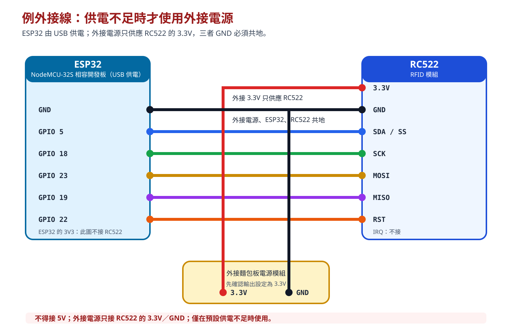

# 專題第 1 章：RC522 RFID 與 SPI

從第 0 章建立的專題工作區開始，用已授權的練習卡確認 ESP32 可透過 SPI 讀到 RC522，但不顯示、保存或傳送完整 UID。

## 你會學到什麼

- 說明 SPI 的 `SCK`、`MOSI`、`MISO`、`SS` 與 `RST` 在 RC522 的角色。
- 依接線表將 RC522 接到 NodeMCU-32S 相容 ESP32，並分辨 `SDA`／`SS` 和 I2C `SDA`。
- 使用 `MFRC522` 函式庫讀取已授權的練習卡，只顯示固定成功文字。
- 在供電不足、找不到卡片或接線不符時，知道先檢查什麼，以及何時停止操作。

## 開始前

- 本章是主線完成後才進行的選做專題；未進行本章，仍可完成[整合專題：完成環境看板](../../08-整合專題.md)。
- 先完成[專題第 0 章：準備、安全與資料契約](../第0章/index.md)，並在其中建立的 `rfid-project` 資料夾內保存本章 Arduino 草稿。
- 需要 NodeMCU-32S 相容 ESP32、RC522、杜邦線與本人或明確獲授權的練習卡。
- 預設由 ESP32 開發板的 `3.3V` 腳位供應 RC522 電源。額外補充的麵包板電源模組只用於供電不足時的排查，不屬於主線材料，也不是本章的預設接線。

請在 Arduino IDE 的「開發板管理員」與「程式庫管理員」確認下列版本，再開始接線與上傳。版本不同時，先調整為下表版本，不要混用範例。

| 項目 | 固定版本／選項 | 用途 |
| --- | --- | --- |
| ESP32 開發板核心 | `esp32 by Espressif Systems 3.3.11` | 提供 NodeMCU-32S 的編譯與上傳工具。 |
| 開發板 | `NodeMCU-32S` | 本章的 ESP32 相容開發板選項。 |
| `MFRC522` | `1.4.12`（GitHub Community） | 讓 ESP32 透過 SPI 使用 RC522。 |

請不要同時安裝或混用 `RFID_MFRC522v2` 的範例；兩者的程式寫法與設定不同。

!!! warning "供電與 UID 安全限制"

    接線、改線或拆線前都要先拔除 ESP32 USB。RC522 只能使用 `3.3V`，不可接 `5V`。只讀取你本人或已明確授權的練習卡；不要列印、截圖、保存、提交或傳送完整 UID。UID 不是可靠的身分驗證，也不能用來控制真實門鎖。

## 成功的樣子

序列監控視窗設定為 `115200` 後，先顯示：

```text
RC522 已就緒，請靠近練習卡
```

將已授權練習卡靠近 RC522 時，顯示：

```text
已讀到練習卡
請移開卡片後，再靠近下一張練習卡
```

整個過程不會出現完整 UID。

## SPI 與這次接線

SPI（Serial Peripheral Interface，序列周邊介面）讓 ESP32 和 RC522 用時脈同步交換資料。`MOSI` 是 ESP32 傳給 RC522 的資料線，`MISO` 是 RC522 傳回 ESP32 的資料線，`SCK` 提供共同時脈，`SS` 選擇目前要溝通的裝置。

RC522 板上的 `SDA` 在這裡是 `SS`（片選），不是 I2C 的資料線；因此不接主線 LCD 使用的 `GPIO 21`。

想先用日常例子弄懂這幾條線怎麼分工，可閱讀[資訊補充：SPI 怎麼讓 ESP32 和 RC522 合作](spi通訊介紹.md)。

| RC522 腳位 | ESP32／電源腳位 | 用途／注意事項 |
| --- | --- | --- |
| `SDA`／`SS` | `GPIO 5` | SPI 片選；不是 I2C `SDA`。 |
| `SCK` | `GPIO 18` | SPI 時脈。 |
| `MOSI` | `GPIO 23` | ESP32 傳送資料到 RC522。 |
| `MISO` | `GPIO 19` | RC522 傳回資料到 ESP32。 |
| `RST` | `GPIO 22` | RC522 重設訊號。 |
| `3.3V` | ESP32 的 `3V3` | 預設供電；不接 `5V`。 |
| `GND` | ESP32 的 `GND` | 預設供電時的共地。 |
| `IRQ` | 不接 | 本章不使用中斷讀卡。 |


預設由 ESP32 的 `3V3` 與 `GND` 供應 RC522。不同 ESP32、RC522 或線材的供電情況可能不同；如果讀卡不穩、ESP32 重開或 USB 斷線，先拔除 USB，再使用下列例外排查方式。

!!! warning "例外：供電不足時才使用外接電源"
    如果讀卡不穩、ESP32 重新啟動或 USB 斷線，可使用已確認設定為 `3.3V` 的麵包板電源模組排查。外接模組只接 RC522 的 `3.3V`／`GND`，並以 GND 線讓外接電源模組、ESP32、RC522 三者共地。不得接 `5V`；電壓、接線或模組標示不明時，停止操作。



### RC522 和 74HC595 有什麼不同？

| 項目 | RC522 | 74HC595 |
| --- | --- | --- |
| 共同訊號 | 使用 `SCK` 與 `MOSI` | 使用資料線與時脈線 |
| 回傳資料 | `MISO` 把讀卡結果回傳 ESP32 | 沒有對應的回傳資料線 |
| 選擇裝置 | `SS` 決定目前和哪個 SPI 裝置通訊 | 鎖存腳決定何時把已送入的資料顯示到輸出腳 |
| `SDA` 名稱 | 板上 `SDA` 是 `SS`，不是 I2C | 不使用 `SDA` 名稱 |

## 步驟 1：安裝函式庫

**目的：** 讓 Arduino IDE 知道如何透過 SPI 和 RC522 溝通。

在 Arduino IDE 開啟「程式庫管理員」，搜尋並安裝 `MFRC522` `1.4.12`，作者應顯示為 GitHub Community。接著開啟「開發板管理員」，確認 `esp32 by Espressif Systems` 是 `3.3.11`，並在「工具 > 開發板」選擇 `NodeMCU-32S`。

預期結果：在兩個管理員中都能看到上方版本表的項目；`NodeMCU-32S` 可在開發板選單中選取。若只找到 `RFID_MFRC522v2`，不要以它取代本章函式庫；它需要不同的驅動設定。

想先知道這個函式庫在程式中如何接手 SPI 溝通、偵測卡片與結束本次讀取，可閱讀[資訊補充：MFRC522 函式庫怎麼使用](mfrc522函式庫介紹.md)。

## 步驟 2：確認供電與 SPI 接線

**目的：** 讓 RC522 在安全且可重複的電源條件下接收 SPI 訊號。

先拔除 ESP32 USB，再依上方表格接線：RC522 的 `3.3V` 接 ESP32 `3V3`，`GND` 接 ESP32 `GND`。麵包板電源模組不是這一步的預設材料；只有出現供電不足症狀時，才依前一節的例外方式改接。

預期結果：所有接線都可對照表格；RC522 沒有接到 `5V`，也沒有把 `SDA`／`SS` 接到 `GPIO 21`。

## 步驟 3：上傳受控讀卡程式

**目的：** 只確認是否讀到已授權練習卡，不把卡片識別資料顯示出來。

執行位置：Arduino IDE／ESP32
檔案：`rfid-project/esp32/rc522_safe_card_read/rc522_safe_card_read.ino`

在第 0 章建立的 `rfid-project` 中，新增 `esp32/rc522_safe_card_read` 資料夾，再建立同名的 `rc522_safe_card_read.ino`。Arduino 草稿的資料夾名稱要和 `.ino` 檔名相同，Arduino IDE 才能正常開啟它。

```cpp
#include <SPI.h>
#include <MFRC522.h>

constexpr byte SS_PIN = 5;
constexpr byte RST_PIN = 22;

// 建立 RC522 物件，並指定片選與重設腳位。
MFRC522 rfid(SS_PIN, RST_PIN);

void setup() {
  Serial.begin(115200);

  // 先啟用 SPI，再初始化 RC522。
  SPI.begin();
  rfid.PCD_Init();

  Serial.println("RC522 已就緒，請靠近練習卡");
}

void loop() {
  // 沒有新卡時直接回到迴圈開頭。
  if (!rfid.PICC_IsNewCardPresent()) {
    return;
  }

  // 本次讀卡不成功時不取用任何卡片資料。
  if (!rfid.PICC_ReadCardSerial()) {
    Serial.println("讀卡失敗，請移開卡片後再試一次");
    return;
  }

  // 只顯示固定狀態，不讀取或列印 UID。
  Serial.println("已讀到練習卡");

  // 結束本次通訊，讓移開後再靠近的卡成為新事件。
  rfid.PICC_HaltA();
  rfid.PCD_StopCrypto1();

  delay(500);
  Serial.println("請移開卡片後，再靠近下一張練習卡");
}
```

程式中的短註解標出初始化、等待新卡、讀卡失敗與收尾的位置。`SPI.begin()` 啟用 SPI，`PCD_Init()` 初始化讀卡機；讀卡成功後，`PICC_HaltA()` 與 `PCD_StopCrypto1()` 結束本次通訊。想了解函式庫的完整角色，可閱讀[資訊補充：MFRC522 函式庫怎麼使用](mfrc522函式庫介紹.md)。

程式刻意不讀取或列印 `rfid.uid`。這樣能確認硬體讀卡流程，又不會把卡片識別資料帶到序列監控、截圖或後續資料流。

上傳後開啟序列監控視窗，設定為 `115200`。

預期結果：先顯示 `RC522 已就緒，請靠近練習卡`。

## 步驟 4：用練習卡確認讀卡

**目的：** 確認 SPI 的雙向資料路徑可正常工作。

將已授權練習卡靠近 RC522，看到成功訊息後先移開，再靠近一次。

預期結果：每次重新靠近卡片時都顯示 `已讀到練習卡`，不顯示完整 UID。若卡片一直貼在讀卡機上，程式可能不會把它當作新卡；先移開後再試。

## 完成時，應能確認

- 能確認 RC522 的 `SDA`／`SS` 接到 `GPIO 5`，不是接到 I2C `GPIO 21`。
- 能確認 RC522 預設由 ESP32 的 `3V3` 供電；若使用外接電源排查，外接電源、ESP32 和 RC522 已共地。
- 序列監控先顯示就緒訊息，練習卡靠近後顯示固定成功訊息。
- 程式、序列監控與截圖中都沒有完整 UID。
- 能理解 `MISO` 是 RC522 回傳資料的線，`SS` 和 74HC595 的鎖存腳用途不同。

## 常見問題

### 序列監控只顯示就緒，卡片靠近沒有反應

先拔除 USB，再檢查 `SDA`／`SS` 是否接 `GPIO 5`、`SCK`／`MOSI`／`MISO` 是否分別接 `GPIO 18`／`GPIO 23`／`GPIO 19`，以及練習卡是否已明確授權。也確認卡片靠近後有先移開，再重新靠近。

### 編譯時找不到 `MFRC522.h`

回到 Arduino IDE 的「程式庫管理員」，確認已安裝名稱為 `MFRC522`、版本為 `1.4.12` 的函式庫。不要同時以 `RFID_MFRC522v2` 的範例取代本章程式。

### 讀卡不穩、ESP32 重開或 USB 斷線

!!! danger "立刻停止並拔除 USB"

    先確認 RC522 沒有接到 `5V`，以及預設接線的 `3V3`／`GND` 是否鬆脫；再依「例外：供電不足時才使用外接電源」的方式排查。若仍不穩，停止操作，不要自行嘗試不明外部電壓或任意改腳位。

### 為什麼不能顯示 UID？

UID 是卡片識別資訊，完整記錄容易外流，而且不能可靠證明身分。這一章只需確認讀卡功能；後續資料流會沿用第 0 章的遮蔽與最小化規則，而不是傳送完整 UID。

## 重點整理

- RC522 透過 SPI 和 ESP32 溝通；`SDA`／`SS` 是片選，不是 I2C 資料線。
- RC522 預設由 ESP32 的 `3V3` 供電；讀卡不穩時，可用已確認的外接 `3.3V` 電源作例外排查，且必須和 ESP32 共地。
- 使用 `esp32 by Espressif Systems 3.3.11`、`NodeMCU-32S` 與 `MFRC522 1.4.12`，不混用 v2 函式庫。
- 固定成功文字足以確認讀卡，不需要也不應該公開完整 UID。

## 下一步

本章只確認 RC522 的受控讀卡流程。若要將練習信封送到網路服務，請繼續閱讀[專題第 2 章｜ESP32 MQTT 假信封事件](../第2章/index.md)。
