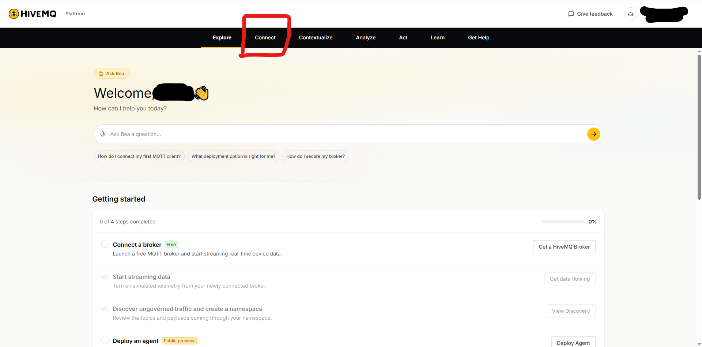
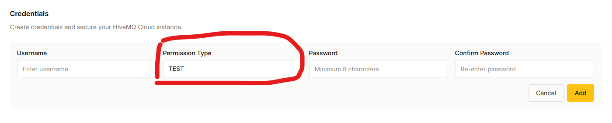
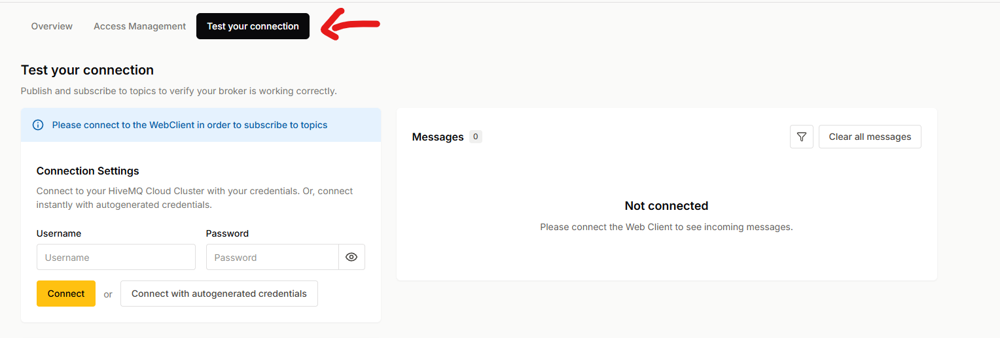
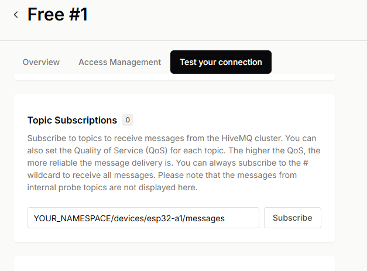
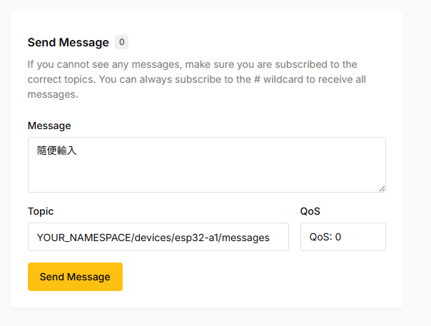

# HiveMQ Cloud 免費測試設定示範

本頁用遮蔽敏感資訊的畫面，示範第 2 章固定假資料實驗需要的 HiveMQ Cloud 設定。

!!! warning "選做實作與安全提醒"

    本頁只適用於第 2 章的短期測試。建立兩組可刪除的測試帳密，只傳送固定假資料；不要傳送真實 RFID UID、個人資料、Wi-Fi 資訊、控制設備指令、出入權限或使用紀錄。圖片中的叢集名稱、主機名稱、權限名稱與 topic 都是示意值，不可直接照填。

## 你會學到什麼

- 在 HiveMQ Cloud 開啟自己的免費測試叢集。
- 找到 ESP32 需要填入的主機名稱與 TLS 連接埠。
- 建立只限單一 topic 的權限，以及 ESP32、網站端各自的測試帳密。
- 用網站端訂閱與發布，準備第 2 章的雙向訊息測試。

## 開始前

你需要先準備：

- [第 2 章首頁：ESP32 MQTT 雙向訊息](index.md)
- [HiveMQ 官方首頁](https://www.hivemq.com/)的 HiveMQ Cloud 免費帳號。
- 可上網、且已確認有使用授權的 Wi-Fi。
- 一個不含個人資料的短名稱，取代下方的 `YOUR_NAMESPACE`。

本頁以 HiveMQ Cloud 的畫面為例。服務介面可能改版；若找不到相對應功能、無法限制單一 topic，或無法刪除帳密，請停止操作。不要改用公開 Broker、非 TLS 連線或共用帳密代替。

## 成功的樣子

完成後，你會有：

- 一個 HiveMQ Cloud 免費測試叢集。
- 一個 `YOUR_NAMESPACE/devices/esp32-a1/messages` 形式的完整 topic。
- 一條只允許對該完整 topic 發布與訂閱的自訂權限。
- ESP32 與網站端各一組不同、可刪除的測試帳密。
- 網站端已訂閱 topic，準備接收 ESP32 的固定測試事件。

## 操作步驟

### 1. 開啟免費測試叢集

目的：進入可設定 MQTT 連線、權限與帳密的叢集頁面。

登入 HiveMQ Cloud 後，選取上方的 `Connect`。在 Network 清單中，開啟自己的 Serverless 免費叢集。




預期結果：你會進入叢集頁面，並看到 `Overview`、`Access Management` 與 `Test your connection` 分頁。

### 2. 記錄 ESP32 的連線資料

目的：取得稍後要填入 `secrets.h` 的主機名稱與連接埠。

在 `Overview` 的 Connection Details 區塊中，找到 MQTT URL 與 Port。將 MQTT URL 中的**主機名稱**填入 `MQTT_HOST`，將 TLS MQTT 使用的連接埠填入 `MQTT_PORT`。本章實測的 TLS 連接埠是 `8883`；請以你自己的控制台顯示值為準。


預期結果：你的 `secrets.h` 有自己的 `MQTT_HOST` 與 `MQTT_PORT`，但沒有把它們貼到公開筆記、截圖或 Git。

### 3. 建立限定 topic 的權限

目的：限制測試帳密只能對本章的單一 topic 收發固定假資料。

1. 切換到 `Access Management` 分頁，在 Authorization 的 Permissions 區塊選取 `Add New`。
2. 權限名稱與說明可使用不含個人資料的文字，例如 `rfid-test-messages`。
3. Permission Type 選擇 `Publish and Subscribe`。
4. Topic Filter 填入你的完整 topic，例如：

   ```text
   YOUR_NAMESPACE/devices/esp32-a1/messages
   ```


預期結果：清單中出現一條自訂權限，Permission Type 是 `Publish and Subscribe`，Topic Filter 是你的完整單一 topic。

!!! warning "不要使用 `#`"

    畫面中原有的 `#` 權限會涵蓋所有 topic，不適合本章。請建立自己的完整 topic 權限，不使用萬用字元。

### 4. 建立兩組不同的測試帳密

目的：讓 ESP32 與網站端以不同身分連線，完成雙端測試。

在相同的 `Access Management` 分頁，於 Authentication 的 Credentials 區塊選取 `Add New`。建立兩組不同帳密：一組給 ESP32，另一組給網站端。兩組都選擇步驟 3 建立的自訂權限。




帳號名稱可用容易辨識、但不含個人資料的名稱，例如 `esp32-test` 與 `web-test`。密碼只填入 HiveMQ Cloud 與自己的 `secrets.h`，不可寫進教材、截圖或 Git。

預期結果：你有兩組不同的測試帳密，兩組都只能對步驟 3 的單一完整 topic 發布與訂閱。

### 5. 使用網站端帳密登入測試工具

目的：讓網站端成為 ESP32 以外的第二個 MQTT 用戶端。

切換到 `Test your connection` 分頁，輸入「網站端測試帳密」，再選取 `Connect`。不要使用自動產生的帳密，因為本章要確認你建立的受限帳密確實可用。



預期結果：右側訊息區不再顯示 `Not connected`，可以顯示收到的訊息。

### 6. 先訂閱完整 topic

目的：在 ESP32 發布固定事件前，讓網站端準備好接收訊息。

在 Topic Subscriptions 區塊輸入步驟 3 的完整 topic，QoS 選擇 `0`，再選取 `Subscribe`。接著回到[第 2 章首頁](index.md)，啟動 ESP32 的固定事件測試。



預期結果：訂閱清單出現你的完整 topic。ESP32 發布後，網站端的訊息區能看到固定 `card_read` 測試事件。

### 7. 從網站端送出固定回覆

目的：確認 ESP32 能收到另一組帳密送出的回覆。

在 Send Message 區塊填入下列文字與相同的完整 topic，QoS 維持 `0`，再選取 `Send Message`：

```json
{"event_id":"evt-001","status":"accepted"}
```



預期結果：ESP32 序列埠監控視窗顯示 `已收到對應的測試回覆。` 若顯示不符合測試規則，先確認回覆文字、topic 與事件代號完全相同。

## 完成時，應能確認

- 你知道 MQTT 主機名稱與 TLS 連接埠要填入 `secrets.h`，但沒有公開它們。
- ESP32 與網站端使用不同帳密，且都只限單一完整 topic。
- 網站端先訂閱，再接收到 ESP32 發布的固定假資料事件。
- 網站端送出固定回覆後，ESP32 顯示已收到對應回覆。
- 測試結束後，你會依[第 2 章首頁](index.md)刪除或重建測試帳密。

## 常見問題

### 找不到 `Add New` 或看見 `#` 權限

先確認位於 `Access Management` 分頁的 Authorization 區塊。不要修改或使用預設的 `#` 權限；請建立只含本章完整 topic 的自訂權限。

### 網站端顯示已連線，卻看不到 ESP32 的事件

確認網站端先訂閱完整 topic，再按 ESP32 的 `EN` 按鈕重新開始。第 2 章使用 retain `false`，網站端晚訂閱時不會收到之前送出的舊訊息。

### 網站端送出回覆後，ESP32 沒有顯示成功

確認網站端使用的是第二組帳密、發布的 topic 完全相同，且回覆是 `{"event_id":"evt-001","status":"accepted"}`。不要加入空白或更改欄位順序。

### 可以只建立一組帳密嗎？

不建議。本頁的目標是讓 ESP32 與網站端各自使用不同的測試帳密，以確認雙端傳遞流程。兩組帳密都應在測試結束後刪除或重建。

## 重點整理

- `Overview` 提供 ESP32 連線需要的主機名稱與 TLS 連接埠。
- `Access Management` 用來建立只限單一 topic 的權限與短期測試帳密。
- `Test your connection` 讓網站端登入、訂閱與發布，協助觀察第 2 章的雙向資料流。
- 所有設定只適用固定假資料實驗；不要使用萬用字元、共用帳密或真實 RFID 資料。

## 下一步

- 回到[第 2 章：ESP32 MQTT 雙向訊息](index.md)，完成 ESP32 端的固定事件發布、回覆測試與帳密撤銷。
