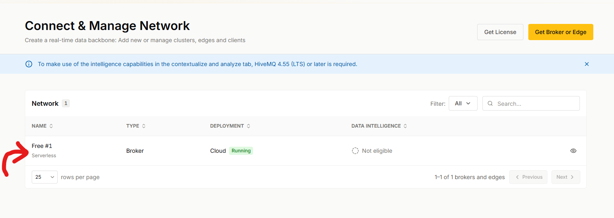
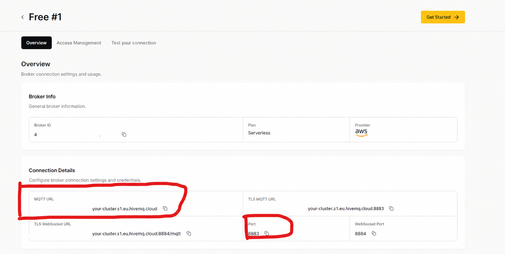
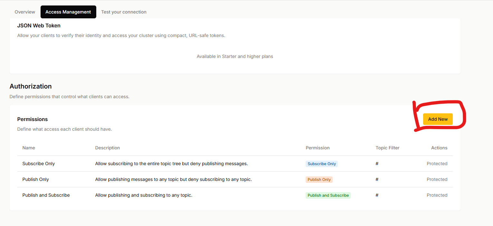
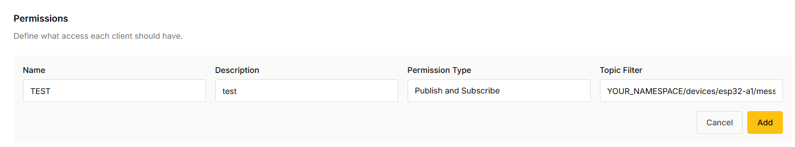
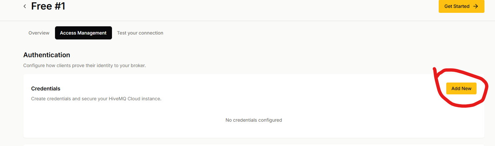

# HiveMQ Cloud 基本設定

HiveMQ Cloud 可以提供 MQTT Broker（訊息中介服務），讓兩個測試用戶端透過同一個受限 topic 交換不含敏感資料的練習訊息。

!!! warning "選做實作與安全提醒"

    本頁需要 HiveMQ Cloud 帳號、已獲授權的網路，以及可刪除的測試帳密。只使用不含個人資料的測試 topic 與假資料；不要傳送 Wi-Fi 資訊、密碼、token、真實 RFID UID、出入紀錄或控制設備的訊息。本專題不控制門鎖、繼電器或其他實體設備。

## 你會學到什麼

- 建立一個 HiveMQ Cloud Serverless 免費測試叢集。
- 找到 MQTT 用戶端需要的主機名稱與 TLS（讓連線內容加密的安全連線）連接埠。
- 建立只允許使用單一 topic 的自訂權限。
- 為兩個測試用戶端建立不同且可刪除的帳密。

## 開始前

- 先閱讀 [MQTT 基礎：發布、訂閱與 Broker](mqtt基礎.md)。
- 建議閱讀 [PubSubClient：MQTT 函式庫介紹](pubsubclient函式庫介紹.md)，先認識 Arduino MQTT 程式會使用的通用函式；不閱讀本頁仍可進行本頁設定。
- 準備可使用的電子郵件帳號與已獲授權的網路。
- 想好一個不含個人資料的短名稱，取代本文的 `YOUR_NAMESPACE`。
- 本頁以 HiveMQ Cloud Serverless 免費方案為例；Starter 與其他方案的權限設定方式不同。

HiveMQ Cloud 的畫面與方案可能調整。若找不到本頁提到的 `Access Management`、無法建立受限權限、無法刪除帳密，或不確定目前使用的方案，請停止操作，改查閱 [HiveMQ 官方快速開始文件](https://docs.hivemq.com/hivemq-cloud/quick-start-guide.html)。不要改用公開 Broker、非 TLS 連線或共用帳密。

## 成功的樣子

完成後，你會有：

- 一個自己建立的 Serverless 測試叢集。
- 一個像 `YOUR_NAMESPACE/demo/events` 的完整測試 topic。
- 一項只允許在該 topic 發布與訂閱的自訂權限。
- 兩組不同、可刪除、都綁定該權限的 MQTT 帳密。

## 操作步驟

### 1. 建立並開啟 Serverless 測試叢集

目的：取得一個用於短期練習的 MQTT Broker。

登入 [HiveMQ Cloud Console](https://console.hivemq.cloud/)，選擇建立 Serverless 免費叢集。叢集出現後，從 `Connect` 開啟它；若畫面要求先選擇 Broker，再選 `Configure`，請依畫面進入該叢集的詳細設定。

預期結果：你能看到叢集的 `Overview` 與 `Access Management` 頁面。

### 2. 記下 MQTT 連線資料

目的：保存稍後給 MQTT 用戶端使用的連線位置。

在 `Overview` 找到連線詳細資料，記下 MQTT URL 中的主機名稱與 TLS 連接埠。HiveMQ Cloud 要求使用 TLS；連接埠請以控制台顯示的值為準。

將這兩項資料只保存在自己的設定檔或密碼管理工具，小心保存，不要公開。

預期結果：你知道自己的 MQTT 主機名稱與 TLS 連接埠，但未把它們公開。

### 3. 建立單一 topic 的自訂權限

目的：讓測試帳密只能收發這次練習的訊息。

切換到 `Access Management`。在 `Authorization` 的 `Permissions` 區塊新增自訂權限，設定如下：

| 欄位 | 建議值 |
| --- | --- |
| 名稱 | `demo-events-only` 等不含個人資料的名稱 |
| 說明 | `只供 MQTT 練習使用` |
| Topic Filter | `YOUR_NAMESPACE/demo/events` |
| Permission Type | `Publish and Subscribe` |

萬用字元是 MQTT 的正常工具，但使用前要先確認它會比對哪些 topic。本頁的單一 topic 不需要萬用字元，所以維持表格中的完整 topic。後續雙 Topic 練習會在固定前綴的最後一層使用 `+`；`#` 會涵蓋其後剩餘的多層 topic，這個練習沒有必要採用。

預期結果：權限清單出現一項自訂權限，且 Topic Filter 只有你的完整測試 topic。

### 4. 建立兩組測試帳密

目的：讓兩個 MQTT 用戶端能以不同身分連線。

在 `Access Management` 的 `Authentication`／`Credentials` 區塊新增兩組帳密，例如 `device-test` 與 `web-client-test`。兩組帳密都選擇步驟 3 建立的自訂權限，密碼使用不同且可刪除的值。

Serverless 方案會讓一組帳密直接選擇一項權限；若畫面改成先建立角色（role），代表你使用的是不同方案，請停止並依官方方案說明設定，不要隨意改用全域權限。

預期結果：帳密清單有兩組不同的測試帳密，且每組都只能使用一個測試 topic。

### 5. 用測試連線頁確認可連線

目的：先確認其中一組帳密可以連到自己的 Broker。

開啟叢集中的 `Test your connection` 分頁，在 `Connection Settings` 填入 `web-client-test` 這組帳密並選取 `Connect`。此分頁會以 Web Client 連線。若名稱或位置不同，請依 [HiveMQ 官方 Web Client 測試說明](https://docs.hivemq.com/hivemq-platform/connect/test-sub-pub-web-client.html) 找到同等功能；不要改用來源不明的公開測試工具。

預期結果：畫面顯示已連線，且你能準備訂閱 `YOUR_NAMESPACE/demo/events`。本頁只確認連線，不發布訊息。

若現在不接著進行後續的 PubSubClient 雙 Topic 練習，請登出 Web Client，並在控制台刪除這兩組只供 `demo/events` 使用的測試帳密。只有在接續進行短時間測試時才保留帳密。

## 完成時，應能確認

- 你能理解 Broker、topic、帳密與權限各自的用途。
- 你的測試帳密彼此不同，並且有小心保存、不公開。
- 權限只包含一個不含個人資料的完整 topic，沒有使用 `#` 或 `+`。
- 你知道 HiveMQ Cloud 的連線資料必須使用 TLS，並已停止在方案或畫面不符合本頁時自行猜測操作。

## 常見問題

### 找不到 `Access Management` 或 `Credentials`

先確認你已開啟自己的叢集詳細設定，而不是帳號總覽。若目前方案與本頁的 Serverless 免費方案不同，欄位可能改成角色或其他權限模型；請依 [HiveMQ 的方案權限說明](https://docs.hivemq.com/hivemq-platform/connect/access-management-options-per-cloud-plan.html) 確認，不要直接選擇涵蓋所有 topic 的預設權限。

### 帳密剛建立或刪除，連線結果沒有立刻改變

HiveMQ Cloud 可能暫存帳密設定，異動最多可能需要約一分鐘才生效。等待後重新連線；若仍不確定帳密狀態，停止使用舊帳密並在控制台移除它們。

### 為什麼本頁不使用 `#` 或 `+`？

`+` 代表一層名稱，`#` 代表其後剩餘的多層名稱。兩者都可用來建立 MQTT 規則，但必須先確認會匹配的範圍。本頁只需要一個完整 topic，使用精確名稱最容易看懂；後續雙 Topic 練習才會將 `+` 固定在必要前綴的最後一層。`#` 的範圍在這兩個練習都太大，因此不採用。

## 重點整理

- HiveMQ Cloud Serverless 可作為 MQTT 的選做測試 Broker。
- 連線資料、帳密與 topic 都不應公開；只使用 TLS 與可刪除的測試資料。
- Serverless 的一組帳密對應一項權限；可依練習需求使用精確 topic 或先確認範圍後使用萬用字元。
- 若控制台或方案和本頁不同，停止操作並以官方文件為準。

## 下一步

- 繼續閱讀[PubSubClient：兩個 Topic 的控制與回傳實作](pubsubclient雙topic控制與回傳.md)，了解 ESP32、兩個帳號與 Web Client 的分工。
- 回到[進階實務模擬專題](../index.md)了解 MQTT 在整體資料流中的位置；不進行後續測試時，刪除測試帳密。
