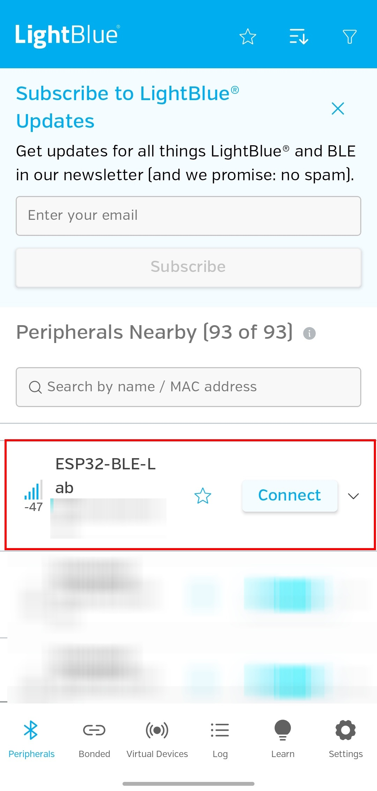
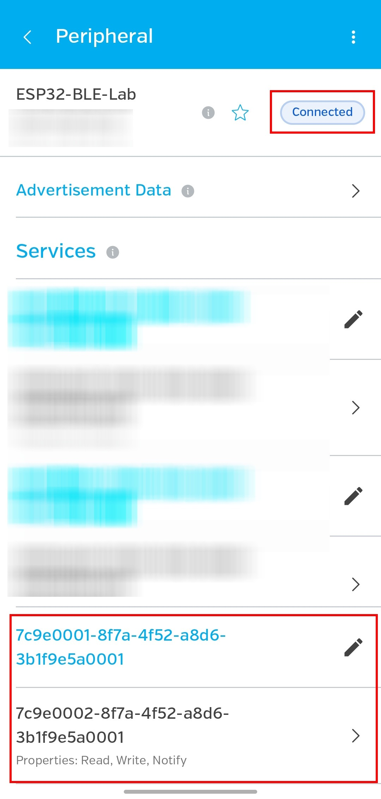
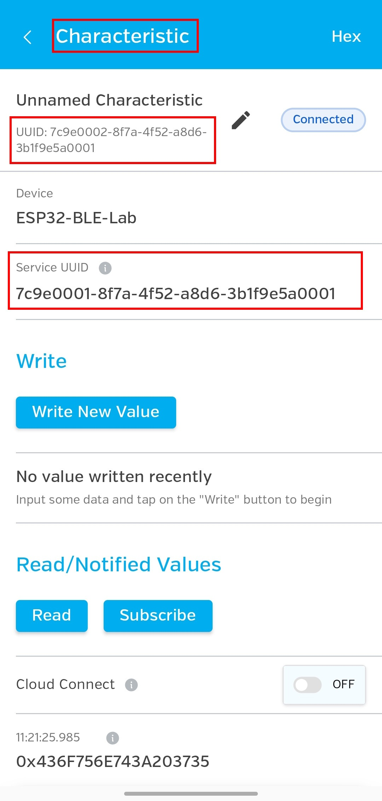
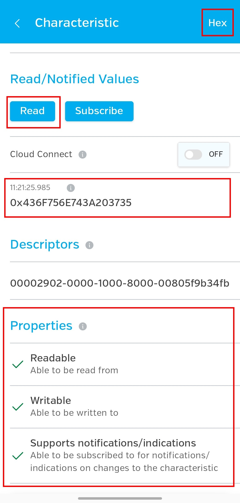
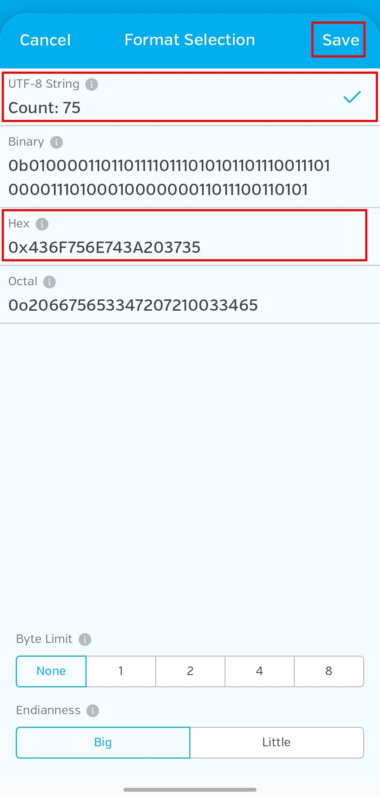
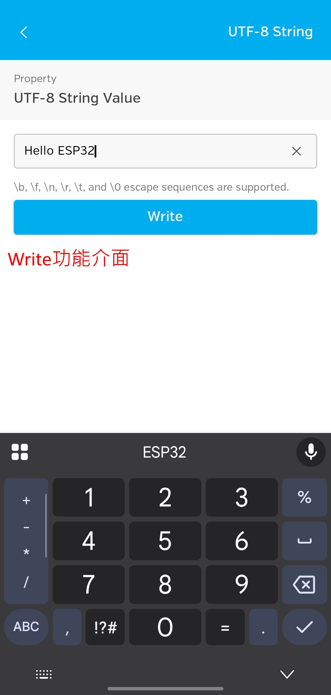
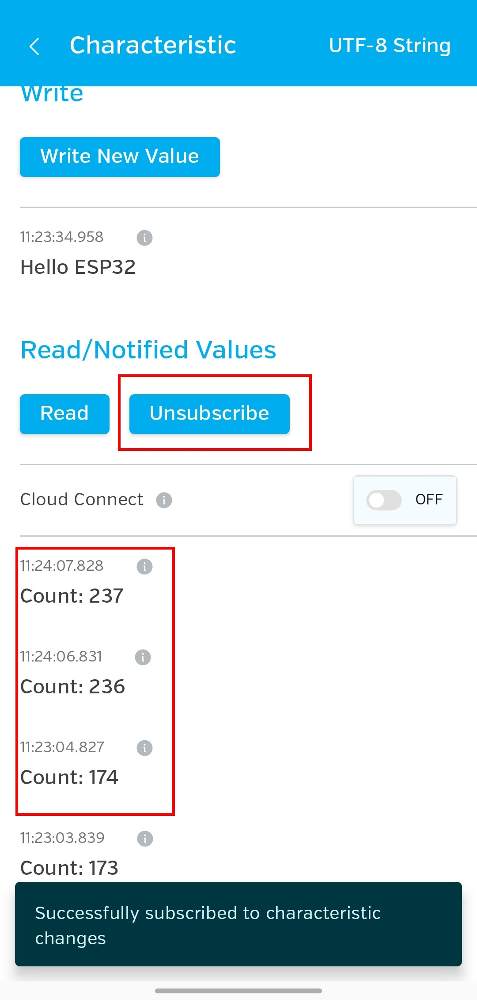
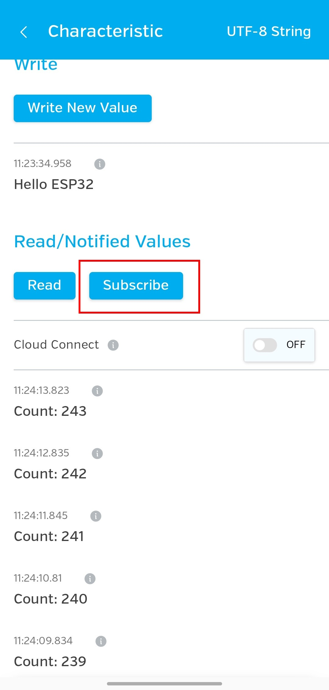
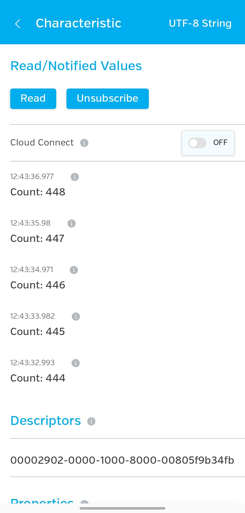

# 選做實作：LightBlue 與 ESP32 交換固定資料

這份練習會讓手機使用 LightBlue 連上 ESP32，並用預先定義的非敏感文字與計數資料完成讀取、寫入與通知三種 Bluetooth Low Energy（BLE，藍牙低功耗）資料交換。

## 你會學到什麼

- 能把手機、ESP32 對應到 BLE 的中央裝置與周邊裝置。
- 能在 LightBlue 中辨認指定的服務、特徵值與 UUID。
- 能分辨讀取（read）、寫入（write）與通知（notify）的資料方向。
- 能確認斷線後，ESP32 可以再次被掃描與連線。

## 開始前

這是需要額外手機的「選做實作」，不影響主線課程成果。請先準備：

- NodeMCU-32S 相容開發板與可傳輸資料的 USB 線。
- 已能替這塊開發板上傳程式的 Arduino IDE。
- Arduino IDE 中的 `esp32 by Espressif Systems 3.3.11`。
- 支援 BLE 的 Android 或 iOS 手機。
- 手機已安裝 Punch Through 的 LightBlue App。
- 已閱讀[BLE：手機與 ESP32 的近距離設定概念](ble近距離設定概念.md)。

本頁不使用 Wi-Fi、RC522、LCD、MQTT、帳號密碼、token、UID 或真實設備控制命令。練習資料只有固定且不敏感的文字。

!!! warning "安全與停止條件"
    BLE 裝置名稱不能證明裝置身分。附近若出現多個無法分辨的 `ESP32-BLE-Lab`，請停止連線，改到只有自己開發板的環境再試。若手機要求與藍牙掃描無關的權限，或程式無法穩定上傳與執行，也先停止操作。不要把密碼、token 或個人資料改成測試內容。

LightBlue 的按鈕位置與文字可能因 Android、iOS 或 App 版本不同。本頁以 `READ`、`WRITE`、`NOTIFY` 性質和 UUID 辨認操作，不依賴固定的畫面位置。

以下截圖來自 Android 版 LightBlue 的實測畫面。畫面使用英文介面；若你的版本外觀不同，請用裝置名稱、完整 UUID、按鈕用途與操作結果比對，不要只依按鈕位置操作。

## 成功的樣子

完成後，你會觀察到以下結果：

```text
手機 LightBlue（中央裝置）
          ↕ BLE
ESP32-BLE-Lab（周邊裝置）

READ   ：ESP32 → 手機，顯示目前的 Count: ...
WRITE  ：手機 → ESP32，序列監控視窗顯示收到 Hello ESP32
NOTIFY ：ESP32 → 手機，持續收到 Count: 1、Count: 2……
```

## 這次使用的 BLE 結構

ESP32 會提供一個服務（service），服務中只有一個特徵值（characteristic）：

```text
ESP32-BLE-Lab
└── Service 7c9e0001-8f7a-4f52-a8d6-3b1f9e5a0001
    └── Characteristic 7c9e0002-8f7a-4f52-a8d6-3b1f9e5a0001
        ├── READ
        ├── WRITE
        └── NOTIFY
```

UUID（通用唯一識別碼）是用來辨認服務或特徵值的一串識別值。手機畫面與 Arduino 程式必須出現相同的 UUID，才代表你找到這次練習的資料位置。

## 步驟 1：上傳 ESP32 程式

1. 用 USB 線把 ESP32 接到電腦。
2. 開啟 Arduino IDE，建立名為 `esp32_ble_fixed_data.ino` 的草稿。
3. 確認 Board 與 Port 和你先前完成 Blink、DHT11 練習時相同。
4. 貼上以下完整程式。

執行位置：Arduino IDE／ESP32  
檔名：`esp32_ble_fixed_data.ino`

```cpp
#include <BLEDevice.h>
#include <BLEServer.h>
#include <BLEUtils.h>
#include <BLE2902.h>

#define DEVICE_NAME "ESP32-BLE-Lab"
#define SERVICE_UUID "7c9e0001-8f7a-4f52-a8d6-3b1f9e5a0001"
#define CHARACTERISTIC_UUID "7c9e0002-8f7a-4f52-a8d6-3b1f9e5a0001"

BLECharacteristic *messageCharacteristic = nullptr;
bool deviceConnected = false;
unsigned long lastNotifyTime = 0;
const unsigned long NOTIFY_INTERVAL = 1000;
unsigned long counter = 0;

class ServerCallbacks : public BLEServerCallbacks {
  void onConnect(BLEServer *server) override {
    deviceConnected = true;
    Serial.println("[BLE] Device connected");
  }

  void onDisconnect(BLEServer *server) override {
    deviceConnected = false;
    Serial.println("[BLE] Device disconnected");
    BLEDevice::startAdvertising();
    Serial.println("[BLE] Advertising restarted");
  }
};

class MessageCallbacks : public BLECharacteristicCallbacks {
  void onWrite(BLECharacteristic *characteristic) override {
    String value = characteristic->getValue();
    Serial.print("[WRITE] Received: ");

    if (value.length() == 0) {
      Serial.println("(empty)");
      return;
    }

    Serial.println(value);
  }
};

void setup() {
  Serial.begin(115200);
  delay(1000);

  BLEDevice::init(DEVICE_NAME);

  BLEServer *server = BLEDevice::createServer();
  server->setCallbacks(new ServerCallbacks());

  BLEService *service = server->createService(SERVICE_UUID);

  messageCharacteristic = service->createCharacteristic(
    CHARACTERISTIC_UUID,
    BLECharacteristic::PROPERTY_READ |
      BLECharacteristic::PROPERTY_WRITE |
      BLECharacteristic::PROPERTY_NOTIFY
  );
  messageCharacteristic->setCallbacks(new MessageCallbacks());
  messageCharacteristic->addDescriptor(new BLE2902());
  messageCharacteristic->setValue("Hello from ESP32");

  service->start();

  BLEAdvertising *advertising = BLEDevice::getAdvertising();
  advertising->addServiceUUID(SERVICE_UUID);
  advertising->setScanResponse(true);
  BLEDevice::startAdvertising();

  Serial.println("[BLE] Service started");
  Serial.println("[BLE] Advertising started");
  Serial.println("Open LightBlue and scan for ESP32-BLE-Lab");
}

void loop() {
  if (deviceConnected) {
    unsigned long now = millis();

    if (now - lastNotifyTime >= NOTIFY_INTERVAL) {
      lastNotifyTime = now;
      counter++;

      String message = "Count: " + String(counter);
      messageCharacteristic->setValue(message.c_str());
      messageCharacteristic->notify();

      Serial.print("[NOTIFY] ");
      Serial.println(message);
    }
  }

  delay(10);
}
```

5. 編譯並上傳程式。
6. 開啟序列監控視窗，將 baud rate 設為 `115200`。

預期會看到：

```text
[BLE] Service started
[BLE] Advertising started
Open LightBlue and scan for ESP32-BLE-Lab
```

Advertising（廣播）可以先理解成 ESP32 持續發出「我可以被掃描」的訊號，讓附近的手機找到它。

若程式無法編譯或上傳，先確認 ESP32 開發板套件版本、Board、Port 與 USB 線，不要繼續手機操作。

## 步驟 2：掃描並連線

1. 開啟手機的藍牙功能與 LightBlue。
2. 依手機提示允許 BLE 掃描需要的藍牙或附近裝置權限。
3. 在掃描結果尋找 `ESP32-BLE-Lab`。
4. 確認附近只有你能辨認的同名裝置，再選擇它並連線。

預期結果：

- LightBlue 從掃描結果找到 `ESP32-BLE-Lab`，接著顯示已連線。
- 序列監控視窗新增 `[BLE] Device connected`。

{ width="420" }

*圖 1：在掃描結果用完整名稱辨認自己的 ESP32，再按 `Connect`。*

圖中裝置名稱因畫面寬度換行，合起來仍是 `ESP32-BLE-Lab`。上方的 LightBlue 電子報提示與本練習無關，可以用右側的 `X` 關閉。

{ width="420" }

*圖 2：`Connected` 代表已連線；紅框中的兩組 UUID 必須和程式相同。*

「掃描得到名稱」和「已建立連線」是兩個不同結果。若只看得到名稱，卻無法開啟服務內容，請先重新掃描並連線。

## 步驟 3：找出服務與特徵值

1. 在已連線的裝置中查看服務清單。
2. 找到 UUID 為 `7c9e0001-8f7a-4f52-a8d6-3b1f9e5a0001` 的服務。
3. 展開服務，找到 UUID 為 `7c9e0002-8f7a-4f52-a8d6-3b1f9e5a0001` 的特徵值。
4. 確認這個特徵值具有 `READ`、`WRITE` 與 `NOTIFY` 性質。

預期結果：LightBlue 顯示的兩組 UUID 與程式完全相同，而且特徵值提供三種操作。若 UUID 不同，請返回服務清單，不要對不明特徵值寫入資料。

{ width="420" }

*圖 3：進入指定 Characteristic 後，可以找到 `Write`、`Read` 與 `Subscribe`。*

{ width="420" }

*圖 4：Properties 區域確認這個 Characteristic 可讀、可寫，也可訂閱通知。*

## 步驟 4：讀取目前值

1. 在指定特徵值執行 `READ`。
2. 將顯示格式切換成能閱讀 UTF-8 文字或字串的格式；不同版本可能把這個格式標為 `UTF-8`、`Text` 或 `String`。

預期結果：LightBlue 顯示當下的計數值；數字依操作時間而不同，例如：

```text
Count: 8
```

這次由手機主動讀取 ESP32 中的目前值，資料方向是 `ESP32 → 手機`。程式啟動時雖先放入 `Hello from ESP32`，手機連線後，計數程式會每秒把目前值更新為 `Count: ...`；因此正常操作時會讀到最新計數。若看到十六進位（Hex）數字，先切換顯示格式，不要修改 UUID 或程式。

{ width="420" }

*圖 5：選擇 `UTF-8 String` 後，位元組資料會顯示成可閱讀的 `Count: ...`。*

圖中的 `Count: 75` 只是截圖當下的值；你的數字不需要相同。

## 步驟 5：寫入固定文字

1. 保持 Arduino IDE 的序列監控視窗開啟。
2. 在同一個特徵值執行 `WRITE`。
3. 選擇能送出 UTF-8 文字或字串的輸入格式。
4. 輸入 `Hello ESP32` 並送出。

{ width="420" }

*圖 6：在 `UTF-8 String` 輸入 `Hello ESP32`，再按 `Write` 送出。*

預期結果：序列監控視窗顯示：

```text
[WRITE] Received: Hello ESP32
```

這次資料方向是 `手機 → ESP32`。Callback（回呼）可以先理解成「指定事件發生時，自動執行的程式」；手機寫入後，`onWrite()` 會自動取得內容並顯示在序列監控視窗。

## 步驟 6：訂閱與停止通知

1. 在同一個特徵值啟用 `NOTIFY`；不同版本可能使用 `Subscribe` 或 `Listen for notifications` 等文字。
2. 觀察 LightBlue 的新資料，也可同時查看序列監控視窗。

預期每秒出現一次遞增內容，例如：

```text
Count: 1
Count: 2
Count: 3
```

這次是 ESP32 在值更新時通知已訂閱的手機。它和 `READ` 的差別是：`READ` 要由手機每次主動要求，訂閱 `NOTIFY` 後則由 ESP32 主動送出更新。

{ width="420" }

*圖 7：按鈕變成 `Unsubscribe`，代表目前已訂閱；下方保留收到的多筆 `Count`。*

截圖只能顯示已收到的資料；實際操作時要在畫面停留數秒，確認新的 `Count` 約每秒持續增加。

3. 在 LightBlue 停止訂閱。

預期結果：LightBlue 不再增加新的通知。畫面可能仍保留先前收到的紀錄；請看時間或項目數量是否停止變化，不要只看舊資料是否還在。

{ width="420" }

*圖 8：按鈕恢復為 `Subscribe`，代表目前沒有訂閱；舊的 `Count` 紀錄仍會留在畫面。*

靜態截圖只能顯示按鈕已回到 `Subscribe`；實際操作時仍要停留幾秒，確認下方沒有新增 `Count`，才能判斷通知已停止。

## 步驟 7：斷線後重新連線

1. 在 LightBlue 中中斷連線。
2. 查看序列監控視窗。

預期結果：

```text
[BLE] Device disconnected
[BLE] Advertising restarted
```

3. 重新掃描並連上 `ESP32-BLE-Lab`。
4. 再次找到相同的服務與特徵值。
5. 至少再做一次 `READ`、`WRITE` 與訂閱 `NOTIFY`。

預期結果：第二次連線仍能完成三種資料交換，不需要重新上傳程式。

{ width="420" }

*圖 9：完成重新連線流程後，再次訂閱並收到多筆 `Count` 的畫面。*

單張截圖不能證明先前曾經斷線。請依本步驟的操作順序，以及序列監控視窗中的 `[BLE] Device disconnected`、`[BLE] Advertising restarted` 和第二次 `[BLE] Device connected`，共同確認重新連線已完成；`READ` 與 `WRITE` 也要實際再操作一次。

## 常見問題

### 掃描不到 `ESP32-BLE-Lab`

先確認序列監控視窗已顯示 `[BLE] Advertising started`，再確認手機藍牙與 BLE 掃描權限。若 App 保留舊掃描結果，可停止後重新掃描。ESP32 尚未開始 Advertising 時，不應把過去留下的名稱當成目前可連線的裝置。

### 連線後找不到指定 UUID

比對完整 UUID，不要只看開頭幾個字元。確認連到自己的 `ESP32-BLE-Lab`，必要時中斷後重新掃描。仍找不到時，重新確認上傳的是本頁程式。

### 每次讀到的 `Count` 數字不同

`READ` 會取得特徵值當下的內容。這份程式讓 `READ`、`WRITE` 與 `NOTIFY` 共用同一個特徵值，而且 ESP32 在手機連線後就會每秒更新計數，不必等手機訂閱通知。因此讀到不同的 `Count: ...` 是預期行為；重點是能取得格式正確的目前值。

### 寫入後序列監控視窗沒有內容

確認使用指定的特徵值、文字輸入格式與 `115200` baud rate。若 App 提供不同的寫入方式，先使用該特徵值明確列出的 `WRITE` 操作；不要向其他未知特徵值反覆寫入。

### 訂閱後沒有收到更新

先確認特徵值具有 `NOTIFY` 性質，而且 App 顯示已啟用訂閱。序列監控視窗若持續出現 `[NOTIFY] Count: ...`，但手機沒有新項目，可先取消訂閱、重新連線，再訂閱一次。

## 完成時，應能確認

- 你能辨認手機是中央裝置，ESP32 是周邊裝置。
- 你能用完整 UUID 找到指定服務與特徵值。
- 你能觀察到 `READ` 是 `ESP32 → 手機`，`WRITE` 是 `手機 → ESP32`。
- 你能分辨主動讀取與訂閱通知的差異。
- 你能確認停止訂閱後不再出現新通知。
- 你能確認斷線後可重新連線並再次交換資料。

## 重點整理

- 掃描、連線、尋找服務與交換資料是不同階段。
- 服務和特徵值透過 UUID 辨認；特徵值只允許程式指定的操作。
- 預先定義的非敏感文字與計數資料足以練習 `READ`、`WRITE` 與 `NOTIFY`。
- 這份最小練習只證明基本 GATT 資料交換可行，不代表已完成安全配對、正式設備設定或 BLE Provisioning。

## 下一步

回到[前導技術概要](index.md)選擇其他獨立主題，或回到[進階實務模擬專題](../index.md)查看整體資料流。這項 BLE 練習不是其他選做實作的前置條件。
