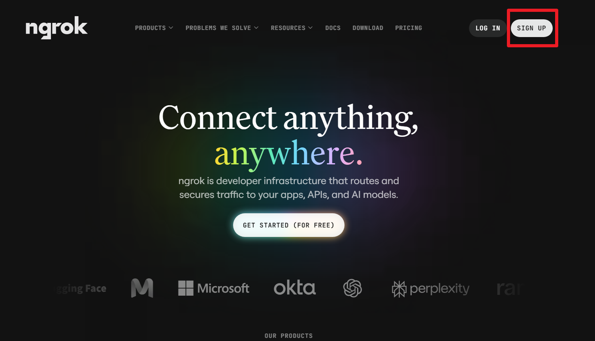
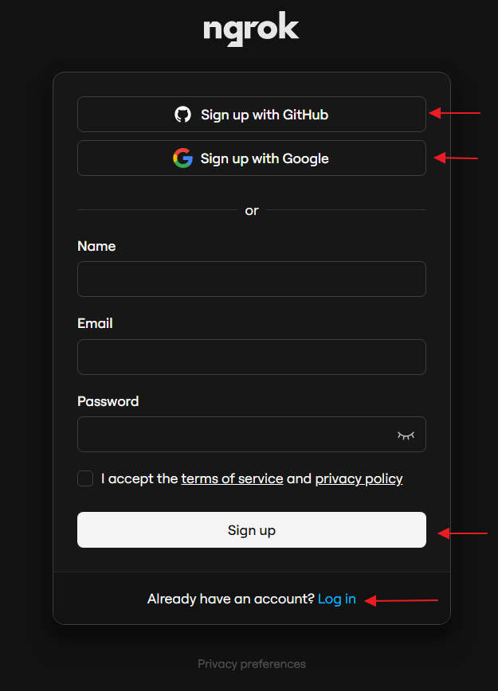
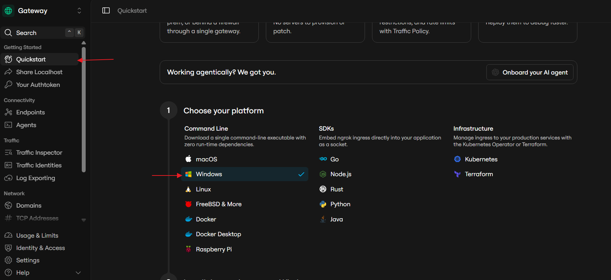
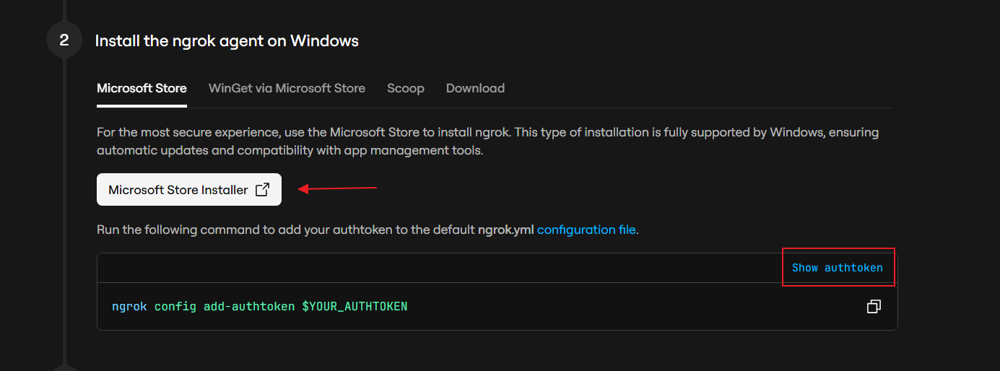
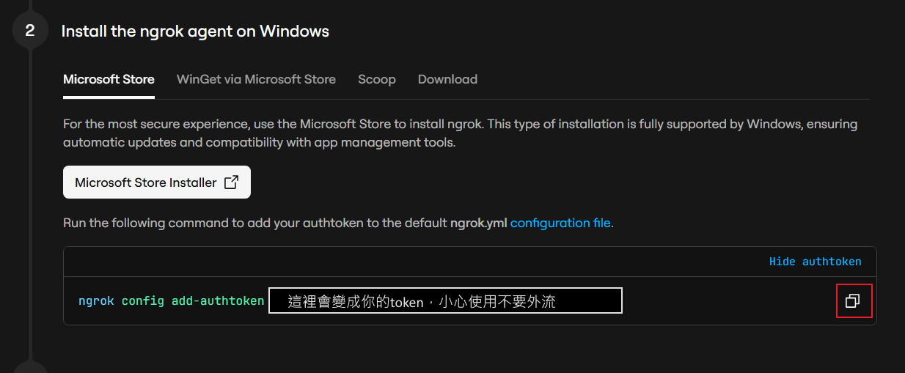

# 選做實作｜ngrok 設定本機 port

這個獨立練習會用一個空白資料夾啟動暫時網頁，讓 ngrok 建立一個指向本機 `8765` port 的暫時 HTTPS 網址，並在結束時把它停止。

## 你會學到什麼

- 能先用 `127.0.0.1` 確認一個本機服務正在運作，再建立 ngrok 通道。
- 能在 Windows 安裝 ngrok Agent，並把自己的 authtoken 儲存在本機設定中。
- 能辨認 ngrok 顯示的暫時 HTTPS 網址與本機 `8765` port 指向同一個練習資料夾。
- 知道公開網址會擴大可連線範圍，並能用 `Ctrl+C` 停止通道與練習網站。

## 開始前

這是選做實作，不是本課主線的必要步驟。完成或不完成本頁，都不影響其他主線教材；本頁也不需要 FastAPI、ESP32、MQTT、手機或其他前導實作。

你需要：

- 先閱讀[ngrok：暫時公開通道的概念](ngrok暫時通道概念.md)，理解公開入口與本機服務的關係。
- Windows 電腦、網路連線與 Python。
- ngrok 帳號，以及可使用 Microsoft Store 安裝程式的 Windows 環境。
- 一個由你自行建立、內容完全空白的專用練習資料夾。例如在「文件」中建立 `ngrok-practice`，不要放入任何既有檔案。

本頁的練習 port 固定使用 `8765`。先在本機瀏覽器確認 `http://127.0.0.1:8765/` 成功，再開啟 ngrok；如果本機測試沒有成功，請不要繼續建立公開通道。

### 安全界線與停止條件

- ngrok 建立的網址可讓網際網路上的人嘗試連線。練習期間，只有空白練習資料夾可以被公開；不要放入個人檔案、帳密、token、照片、專案程式碼或任何不想分享的資料。
- `--bind 127.0.0.1` 讓練習網站只在本機 port 上接聽；但 ngrok Agent 仍會把外部要求轉到這個本機服務。因此，開啟 ngrok 後不能把它理解成「只有自己看得到」。
- authtoken 是祕密資料。不要在公開貼文、共用文件、聊天、截圖或錄影中顯示它；含有 authtoken 的 ngrok 設定檔只留在自己的電腦。
- 若畫面、終端機紀錄或網址中出現不該公開的資料，立即按 `Ctrl+C` 停止 ngrok，從 Dashboard 撤銷或更換 authtoken，並刪除已公開的內容後才繼續。
- 不知道如何停止、無法確認目前公開的是空白練習資料夾，或需要把網址提供給無關的人時，請不要開啟通道。

## 成功的樣子

同一個空白資料夾會先在本機網址 `http://127.0.0.1:8765/` 顯示目錄頁面；ngrok 執行後，終端機會顯示一個指向 `http://localhost:8765` 的 `Forwarding` HTTPS 網址。用瀏覽器開啟那個網址時，會看到相同的空白資料夾目錄頁面。

網址由 ngrok 當次執行時產生。通道尚未停止時，持有網址的人可能嘗試連線；本頁只在自己的瀏覽器測試，未確認內容與存取限制前不要分享網址。

## 操作步驟

### 1. 建立只供練習的本機網站

先建立一個完全空白的專用資料夾，例如 `ngrok-practice`。在檔案總管開啟這個資料夾，於資料夾空白處按滑鼠右鍵，選擇「在終端機中開啟」。之後的 Python 指令必須在這個空白資料夾執行。

執行位置：PowerShell／空白的 `ngrok-practice` 資料夾

```powershell
python -m http.server 8765 --bind 127.0.0.1
```

`http.server` 是 Python 內建的簡易靜態網站伺服器；它會把「目前資料夾」中的檔案提供給瀏覽器。`8765` 是這次練習使用的 port，`--bind 127.0.0.1` 表示伺服器只在這台電腦接聽。

畫面應出現包含 `Serving HTTP on 127.0.0.1 port 8765` 的訊息。保持這個終端機開著，另開瀏覽器到：

```text
http://127.0.0.1:8765/
```

因為資料夾是空的，瀏覽器應顯示目錄頁面，例如 `Directory listing for /`。這是本頁的最小成果；不要為了測試而加入個人檔案。

如果出現「連線被拒絕」或 port 已被占用，先按 `Ctrl+C` 停止這個指令，再選擇另一個未使用的練習 port。假設改成 `8766`，後續三處都必須一起改為 `8766`：Python 指令、`http://127.0.0.1:8766/`，以及後面的 `ngrok http 8766`。完成本機測試前，不要繼續下一步。

### 2. 建立 ngrok 帳號並開啟 Windows Quickstart

開啟 [ngrok 官方網站](https://ngrok.com/)，選擇 `SIGN UP` 建立帳號；若已有帳號，請選擇登入。帳號密碼僅供你自己輸入，不要記錄在共用文件或截圖中。



如果你需要建立帳號，註冊頁可以使用 GitHub、Google 或電子郵件方式；選擇你願意使用的方式即可。



登入後，Dashboard 的導覽名稱與位置可能隨版本調整。開啟 `Quickstart`，並在 Command Line 的平台選擇 `Windows`。



### 3. 從 Microsoft Store 安裝 ngrok Agent

在 Windows Quickstart 的安裝步驟選擇 `Microsoft Store Installer`，依 Microsoft Store 的畫面完成安裝。官方目前將 Microsoft Store 列為 Windows 的建議安裝方式，因為它可處理更新。



安裝完成後，重新開啟一個 PowerShell 視窗，輸入下列指令確認 Agent 可被找到。

執行位置：PowerShell／電腦

```powershell
ngrok version
```

應能看到 `ngrok version` 開頭的版本資訊。若 PowerShell 顯示找不到 `ngrok`，先關閉並重新開啟終端機；若仍無法使用，回到 Microsoft Store 確認安裝完成，再停止本頁操作。

### 4. 在本機設定 authtoken

回到 Dashboard 的 Windows Quickstart。在上方 Windows Quickstart 圖片所示的 authtoken 區域按下 `Show authtoken`。網站會把原本的 `$YOUR_AUTHTOKEN` 換成你的 token，並組成一整行可執行的 `ngrok config add-authtoken ...` 指令。

接著按該指令最右側的複製按鈕，也就是下圖紅框位置。這個按鈕複製的是包含 token 的完整指令，不只是 token 本身。本頁圖片中的 token 已替換成安全提醒文字；你實際看到的內容只供自己的電腦使用，不要截圖或分享。



開啟 PowerShell，直接貼上剛才複製的完整指令。按下 `Enter` 前，只需確認它以 `ngrok config add-authtoken` 開頭；後面的 token 不要另外複製到其他地方。

執行位置：PowerShell／電腦

請執行 Dashboard 複製按鈕提供的完整指令，不要只輸入上述指令開頭。完成後，終端機應顯示已將 authtoken 儲存至設定檔的訊息。

這個設定檔在你的電腦上保存祕密資料。不要開啟後截圖，也不要上傳到共用位置。若 token 曾經外流，請先停止通道，改在 ngrok Dashboard 撤銷或更換它，而不是繼續使用舊值。

### 5. 建立指向 `8765` 的暫時通道

確認步驟 1 的 Python 終端機仍在執行，且本機網址仍能打開。接著在另一個 PowerShell 視窗執行：

執行位置：PowerShell／電腦（第二個終端機）

```powershell
ngrok http 8765
```

這個指令告訴 ngrok 將外部 HTTP／HTTPS 要求轉到本機的 `8765` port。成功時，終端機會顯示類似下列用途的文字；`<本次由 ngrok 產生的網址>` 不是可直接使用的真實網址。

```text
Forwarding  https://<本次由 ngrok 產生的網址> -> http://localhost:8765
```

!!! warning "下圖只用來辨認 Dashboard 的步驟位置"
    不要照抄圖中的 `80`、`--url` 或網址。本頁只執行上方已在本機確認過的 `ngrok http 8765`。


Dashboard 可能依帳號狀態顯示不同示例。這一頁不加入 `--url`，也不記錄實際外部網址。

複製你自己終端機實際顯示的 `https://` 網址，僅貼到自己的瀏覽器網址列。應看到與步驟 1 相同的空白資料夾目錄頁面。如果看到不同內容、帳號登入頁或任何私人資料，立即停止通道並回頭確認目前資料夾是否真的空白。

### 6. 停止通道與本機網站

測試完成後，先回到執行 `ngrok http 8765` 的終端機並按 `Ctrl+C`。這會停止 Agent 的暫時通道；重新整理剛才的公開網址時，它不應再連到你的本機資料夾。

接著回到執行 `python -m http.server 8765 --bind 127.0.0.1` 的終端機按 `Ctrl+C`，停止本機網站。關閉終端機與瀏覽器頁籤後，這次練習就結束了。

## 完成時，應能確認

- 在開啟 ngrok 前，`http://127.0.0.1:8765/` 顯示空白練習資料夾的目錄頁面。
- `ngrok http 8765` 顯示一個轉送到 `http://localhost:8765` 的暫時 HTTPS 網址。
- 用自己的瀏覽器開啟該 HTTPS 網址時，看到與本機網址相同的目錄頁面。
- 停止 ngrok 後，外部網址不再連到這台電腦；停止 Python 後，本機網址也不再提供目錄頁面。
- 過程中沒有在公開貼文、共用文件、聊天、截圖或錄影中顯示 authtoken；未確認內容與存取限制前，也沒有分享仍在運作的 ngrok 網址。

## 常見問題

### `python` 找不到，或本機網址無法開啟

先確認 Python 已安裝且 PowerShell 可執行 `python --version`。再確認 Python 指令仍在執行的終端機中，並使用完全相同的 port `8765` 開啟 `http://127.0.0.1:8765/`。在本機網址成功前，不要啟動 ngrok。

### `8765` 被占用或出現拒絕連線訊息

停止目前的 Python 指令後，改用另一個未使用的練習 port，例如 `8766`。Python 指令、本機網址與 ngrok 指令的數字必須完全一致：`python -m http.server 8766 --bind 127.0.0.1`、`http://127.0.0.1:8766/`、`ngrok http 8766`。如果仍無法判斷是哪個程式占用 port，先停止本頁操作。

### PowerShell 顯示找不到 `ngrok`

確認 Microsoft Store 的 ngrok 安裝已完成，然後關閉並重新開啟 PowerShell。若仍無法執行，請不要改用不明來源的下載檔；回到 ngrok 官方 Windows 安裝頁確認目前的安裝方式。

### ngrok 已啟動，但公開網址顯示錯誤或不是目錄頁面

先停止 ngrok。確認本機 `http://127.0.0.1:8765/` 能顯示空白資料夾目錄頁面，而且 `ngrok http 8765` 與 Python 指令使用同一個數字。確認後再重新啟動；不要在不確定公開內容時反覆嘗試。

### 不小心貼出 authtoken 或公開網址怎麼辦？

立即按 `Ctrl+C` 停止 ngrok。不要把外流的 token 複製到其他地方；請登入 ngrok Dashboard，依目前介面撤銷或更換 token，並移除已公開的文字、截圖或檔案。確認新 token 沒有外流後，才重新開始。

## 重點整理

- 先讓空白資料夾的本機服務在 `127.0.0.1:8765` 成功運作，才建立 ngrok 通道。
- `ngrok http 8765` 會將當次產生的 HTTPS 網址轉到本機的 `8765` port；它沒有把檔案搬到雲端。
- 空白資料夾是刻意設計的安全範圍：通道開啟時，該資料夾中的內容可能被外部連線者讀取。
- authtoken 必須保密；仍在運作的公開網址是可連入的入口，未確認內容與存取限制前不要分享。結束時以 `Ctrl+C` 停止 ngrok 與 Python。

## 參考資料

- [ngrok 官方：Windows Download & Install](https://ngrok.com/download/windows)
- [ngrok 官方：Share Localhost](https://ngrok.com/use-cases/share-localhost)
- [ngrok 官方文件：什麼是 ngrok？](https://ngrok.com/docs/about)

## 可選串接：FastAPI

這一頁已經完成 ngrok 的獨立練習，不需要 FastAPI。若你已另外完成 [FastAPI Hello World](fastapi-hello-world實作.md)，可先在本機確認 FastAPI 使用的實際 port，再把 `ngrok http 8765` 中的 `8765` 改成相同的 port。仍應先以本機網址確認內容與安全範圍，並在測試結束後停止通道。
