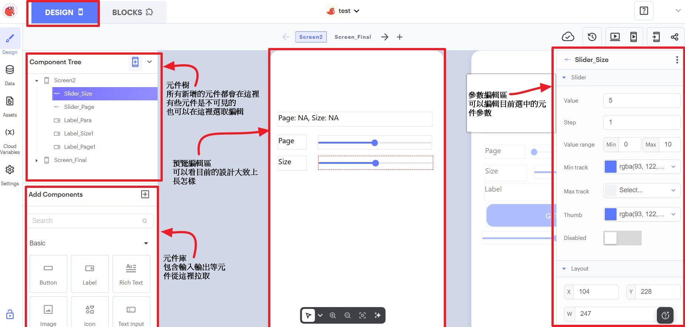
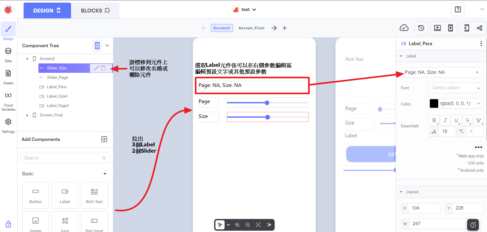

# 選做實作：Thunkable 瀏覽政府開放資料清單

用 Thunkable 讀取新北市政府行政人事行事曆 API，調整查詢範圍後，在手機上選擇並閱讀本次回應中的一筆資料。

!!! info "這是選做實作"
    這一頁需要 Thunkable 帳號、Android 或 iOS 裝置與網路，不是主線課程的前置條件。未進行本頁，仍可繼續完成 ESP32、Python、CSV、圖表與 Gradio 的主線教材。

## 你會學到什麼

- 能分辨 API 的 `page`（頁碼）、`size`（每頁筆數）與回應清單索引各自控制什麼。
- 能在 Thunkable 的 Web API 元件設定端點、Query Parameters（查詢參數）與 `GET` 要求。
- 能將 JSON List（JSON 清單）保存到 App 變數，再用 Slider 顯示其中一筆資料。
- 能從「讀取中」、空清單、錯誤與 HTTP 狀態碼，判斷這次讀取的結果。

## 開始前

先閱讀[Thunkable：App 與 Web API 的概念](thunkable與web-api概念.md)，並準備：

- 電腦瀏覽器與 Thunkable 帳號。
- Android 或 iOS 裝置，並安裝官方 [Thunkable Live 測試 App 說明](https://docs.thunkable.com/getting-started/live-test)所連結的 App。本頁的讀取結果以 Thunkable Live 實機測試為準，不以電腦 Web Preview 取代。
- 可正常連線的 Wi-Fi。本練習不需要 ESP32、額外硬體、付費服務或 API Token。
- App Inventor 的元件、屬性、事件與積木概念。這些概念可直接帶到 Thunkable；但元件名稱、積木名稱與所在位置可能不同，請以目前畫面與本頁截圖為準。

!!! warning "公開專案與停止條件"
    Thunkable 的公開專案可被其他人檢視、預覽或 remix。因此專案名稱、元件文字、網址和積木中都不要放入個人資料、密碼、Token、固定私有 IP 或內網網址。本練習只使用公開、唯讀的資料端點。若你的方案只能建立公開專案，而你必須放入敏感資料，請停止，不要繼續建立這個專案。

!!! warning "網路讀取的停止條件"
    請使用可正常讀取網站的 Wi-Fi。若 Thunkable Live 長時間沒有回應，或出現無法理解的錯誤，停止這次測試並保留錯誤訊息；不需要修改手機 APN、網路設定，也不要加入第三方 CORS Proxy（跨來源代理服務）。

## 成功的樣子

你可以設定 `page=0`、`size=50`，按下 `GET API` 後看到「收到資料，共計：50 筆」或一筆行事曆資料；資料索引 Slider 的可選範圍會變成 `1` 到 `50`。移動資料索引 Slider 時，畫面只切換已收到的資料，不會再次呼叫 API。

## 先分清楚三個數字

| 名稱 | 作用時間 | 起始值 | 例子 |
| --- | --- | --- | --- |
| `page` | 按下 `GET API` 時，指定 API 要回傳哪一頁 | API 從 `0` 起算 | `page=0` 是第一頁 |
| `size` | 按下 `GET API` 時，指定一頁最多要幾筆 | 本頁設定 `1` 至 `100` | `size=50` 最多取得 50 筆 |
| 資料索引 | 收到清單後，選擇目前顯示哪一筆 | 本頁設定從 `1` 起算 | 第 `41` 筆 |

`page` 與 `size` 改變後，要再按一次 `GET API` 才會送出新的要求。資料索引 Slider 則只讀取 App 已保存的本次清單。

!!! note "清單索引設定"
    本頁的專案使用第一筆索引為 `1` 的清單設定，所以資料索引 Slider 的最小值是 `1`。若你的專案啟用了零起算索引，請先改回與本頁一致的設定，否則「第 1 筆」會取到不同資料或超出範圍。

## Stage 0：建立 Thunkable 專案

### 1. 開啟登入入口（圖 0-001）

開啟 [Thunkable 官網](https://thunkable.com/)。尚未有帳號時選擇 `Sign up`；已有帳號時選擇 `Login`。

接著會進入選擇登入方式的畫面。

### 2. 選擇登入方式（圖 0-002）

選擇 Google 或電子郵件登入。本頁後面的手機測試依官方文件整理這兩種連線方式；若你已使用 Apple 登入，請先查看官方 Live Test 文件是否有適用方式，無法確認時可停止手機測試。

登入後，不要把帳號、密碼或登入郵件記錄在公開專案中。

### 3. 進入積木工作區（圖 0-003）

登入後若先看到新版 Thunkable AI 首頁，選擇左上角的 `Go to x.thunkable.com`。本頁使用的是有 Design 與 Blocks 的積木工作區。

畫面切換後，應能找到專案清單，而不是只有 AI 文字輸入區。

### 4. 建立空白專案（圖 0-004）

在工作區依序選擇左側 `My Projects`，再選擇 `Create Blank Project`。若改版後按鈕位置不同，先回到 `My Projects` 尋找建立空白專案的入口；不要用 AI 產生專案取代本頁的元件與積木。

選擇後會開啟專案基本資料與建立方式的設定畫面。

### 5. 填寫專案設定並建立（圖 0-005）

Project Name（專案名稱）可填 `calendar-browser`；Category（分類）若必填可選 `Just Testing`。若只能建立 Public（公開）專案，確認沒有敏感資料後，保持 `Use the Drag and Drop Builder` 已勾選，選擇 `Create`。

建立完成後，上方應能切換 `Design` 與 `Blocks`。完成時，應能確認你有一個可放入元件、編輯事件的空白專案。

## Stage 1：建立 Page 與 Size 介面

先做不連網的介面；這個 Stage 只確認 Slider 與 Label 的互動，還不會讀取 API。

### 1. 先辨認 Design 畫面的區域（圖 1-001）

切到 `Design` 分頁。先辨認左側的 Component Tree（元件樹）與 Add Components（元件庫）、中央的手機預覽區，以及右側的元件參數編輯區。圖 1-001 是元件已加入後的區域導覽示意；你此時還沒看到圖中的 Label、Slider 或名稱是正常的，下一步才會建立。圖中的數值也只是介面位置範例，先不要照著設定。

點選元件樹中的元件後，右側會顯示該元件可調整的文字、數值與範圍。

### 2. 加入、重新命名並設定元件（圖 1-002）

從 Add Components 拖入 3 個 Label 與 2 個 Slider，再於元件樹中重新命名為 `Label_Para`、`Label_Page1`、`Slider_Page`、`Label_Size1`、`Slider_Size`。先將 `Label_Para` 設為圖中的 `Page: NA, Size: NA`；另外兩個 Label 分別設為 `Page`、`Size`。`Slider_Page` 的最小值與初始值都是 `0`；`Slider_Size` 的最小值、最大值、初始值分別為 `1`、`100`、`50`，兩個 Slider 的 `Step` 都是 `1`。下一步加入初始化積木後，`NA` 才會更新為實際數值。

完成後，元件樹應有 3 個 Label 與 2 個 Slider；中央預覽區能看到 Page、Size 與兩條 Slider。此時移動 Slider，`Label_Para` 還不會自動更新。

### 3. 初始化 Slider 範圍（圖 1-003）

在 Blocks 區建立 App 變數 `TOTAL_DATA_COUNTS`，暫時設為 `2000`。它只用來推估可選的最大頁碼，**不是** API 保證提供的即時總筆數。接著在 `Screen Starts` 建立「元件初始化」函式：設定兩個 Slider 的初始值，並把 `Slider_Page` 最大值設成 `ceil(2000 ÷ 目前 size) − 1`，最後呼叫「更新參數顯示」。

畫面第一次開啟時，`Slider_Size` 應在 `50`，`Slider_Page` 應從 `0` 開始。

### 4. 處理 Size 改變事件（圖 1-004）

在 `Slider_Size Value Change` 事件套用相同的頁碼上限公式；若目前頁碼超過新上限，將它調回上限，再呼叫「更新參數顯示」。兩個 Slider 的 Value Change 事件都要呼叫這個顯示函式，將 `Label_Para` 更新成 `Page: <Slider_Page 的值>, Size: <Slider_Size 的值>`。

!!! warning "請把圖中的 round 改成 round up"
    原始操作截圖的下拉選項顯示一般的 `round`，實作時請改選 `round up`（無條件進位），讓公式與初始化積木一致：`ceil(TOTAL_DATA_COUNTS ÷ Slider_Size.value) − 1`。若使用一般四捨五入，當總筆數無法被 `size` 整除時，可能會少算最後一頁。

完成時，應能確認移動任一 Slider 後，`Label_Para` 立刻顯示相同的數值，且畫面仍不會讀取網路資料。

## Stage 2：設定 Web API 並用固定參數讀取

### 1. 確認 API 的參數（圖 2-001）

先查看新北市政府資料開放平臺的 API 說明：`page` 是從 `0` 起算的頁碼，`size` 是每頁筆數。這個 Stage 先用固定的 `page: 0`、`size: 100`，尚未和 Slider 連動。

記住這組固定值；Stage 3 才會改用 Slider 的值。

### 2. 加入 Web API 元件（圖 2-002）

到 Blocks 的 Advanced 加入 Web APIs 元件，命名為 `Web_API1`；同時建立 App 變數 `api_response`，初始值為 empty list（空清單）。

加入後，`Web_API1` 會出現在 Blocks 的元件清單中。

### 3. 設定 Web API（圖 2-003）

開啟 `Web_API1` 設定，URL 填入 `https://data.ntpc.gov.tw/api/datasets/308dcd75-6434-45bc-a95f-584da4fed251/json`；Query Parameters 分別新增 `page: 0`、`size: 100`；Headers 新增 `accept: application/json`。

!!! warning "URL 不要包含查詢參數"
    URL 欄位只能填端點本體，**不要**填入 `?page=0&size=100`。`page`、`size` 要分別新增到 Query Parameters，才能在 Stage 3 安全地用 Slider 更新它們。

設定儲存後，Web API 會先以固定的 `page: 0` 與 `size: 100` 準備讀取。

### 4. 加入讀取與顯示元件（圖 2-004）

回到 Design 區，加入 `Button_Call`、`Result_Text`（Rich Text）與 `Slider_index`。按鈕文字設為 `GET API`，Rich Text 初始文字設為「初始化」；資料索引 Slider 最小值和初始值為 `1`，`Step` 為 `1`，先設為停用。

資料索引 Slider 先停用，可避免還沒收到清單時讀取不存在的資料。

### 5. 初始化讀取元件（圖 2-005）

回到 Stage 1 的初始化函式，將 `Result_Text` 設為「初始化」、按鈕文字設為 `GET API`。把 `Slider_index` 的最小值與目前值設為 `1`，最大值先設為 `Slider_Size` 的 value，`Step` 設為 `1` 並保持停用。此時索引 Slider 尚未啟用，所以不會真的讀取這個暫定範圍；Stage 4 收到資料後，最大值會改成實際清單長度。

重新開啟畫面時，應先看到初始化訊息與無法移動的資料索引 Slider。

### 6. 用固定參數呼叫 GET（圖 2-006）

在 `Button_Call Click` 事件中呼叫 `Web_API1 Get`。沒有 `error` 時，把 `response` 用「get object from JSON」轉成 JSON 清單，保存到 `api_response`，並在 `Result_Text` 顯示 `收到資料，共計：<清單長度> 筆`。

此時即使 `Label_Para` 顯示 `Size: 50`，GET 仍使用 Web API 設定中的固定 `size: 100`；這是本階段預期的中間結果。

### 7. 確認固定讀取結果（圖 2-007）

按下 `GET API`，觀察畫面是否收到 100 筆。這張圖中的 Label 仍是 `Size: 50`，但 Web API 的固定 `size: 100` 生效，因此顯示 100 筆。

完成時，應能分辨畫面 Label 的數值與 Web API 固定參數仍是兩件事；下一個 Stage 才會把兩者連結。

## Stage 3：讓 Slider 更新 Query Parameters

### 1. 寫入動態查詢參數（圖 3-001）

回到 Stage 1 的「更新參數顯示」函式。在更新 `Label_Para` 後，加入「set `Web_API1`'s QueryParameters」積木，使用 create object（建立物件）：`page` 填 `Slider_Page` 的 value，`size` 填 `Slider_Size` 的 value。

圖的上半部是原本的「更新參數顯示」，下半部將名稱縮短成「更新參數」並加入新積木。兩者代表同一個函式，不要另外建立第二個函式。本頁可繼續保留「更新參數顯示」這個名稱。

移動 Page 或 Size Slider 現在只是在準備下一次要求；請等畫面不是「讀取中」時，再按 `GET API`。

### 2. 確認動態讀取結果（圖 3-002）

設定 `page=0`、`size=50` 後按 `GET API`。若畫面顯示收到 50 筆，表示這次 Query Parameters 已使用 Slider 的值。

完成時，應能確認調整 `size` 後重新讀取，收到的筆數會跟著改變。

## Stage 4：顯示一筆資料並處理讀取狀態

### 1. 建立單筆資料顯示函式（圖 4-001）

建立「更新讀取結果顯示」函式，先判斷 `length of api_response > 0`。有資料時，從 `api_response` 取出 `Slider_index` 指定的一筆，將序號、`name`、`holidaycategory`、`date` 組成 `Result_Text`；清單是空的時，顯示「讀到的資料清單為空」。

`name` 可能是空白，例如一般週末未必有特別名稱；空白不代表 API 讀取失敗。

### 2. 在讀取時處理舊資料、錯誤與狀態（圖 4-002）

把 `Button_Call Click` 改為：先停用 `Button_Call` 與 `Slider_index`，把資料索引最大值與目前值重設為 `1`，顯示「讀取中...」，並將 `api_response` 設為 empty list，最後呼叫 `Web_API1 Get`。回呼中先判斷沒有 `error`，再判斷 `status = 200`；成功才轉換並保存 `response`。若清單有資料，將資料索引最大值設成實際清單長度並解除停用；無論清單是否有資料，都呼叫「更新讀取結果顯示」。

發生 `error` 時顯示 `收到錯誤：<錯誤內容>`；沒有 `error` 但 `status` 不是 `200` 時，顯示 `收到異常狀態碼：<status>`。兩種情況都保持資料索引 Slider 停用，回呼結束前重新啟用 `Button_Call`。

### 3. 讓資料索引只切換本次清單（圖 4-003）

在 `Slider_index Value Change` 事件呼叫「更新讀取結果顯示」函式，但不要呼叫 `Get`。

移動資料索引 Slider 時，Rich Text 應只切換已收到的資料，不會重新送出 API 要求。

### 4. 用 Thunkable Live 測試（圖 4-004）

在電腦開啟專案後，依官方[測試步驟](https://docs.thunkable.com/getting-started/live-test)連接 Thunkable Live：在瀏覽器選擇 `Live Test on Device`，再於 Android 或 iOS 裝置開啟 Thunkable Live。Google 登入時，手機使用同一個 Google 帳號；電子郵件登入時，瀏覽器選 `Enter my code`，手機選 `Email sign in - Generate test code`，輸入測試碼後選 `Connect`。

在手機開啟本頁建立的專案，測試 Page、Size、`GET API` 與資料索引 Slider。公開資料可能更新，所以日期、分類與索引不必和圖片相同；重點是參數、索引與單筆欄位會依操作改變。

!!! warning "讀取中不要改參數"
    本練習在讀取期間會停用按鈕與資料索引 Slider，但 Page／Size Slider 仍可移動。`Result_Text` 顯示「讀取中...」時請不要調整 Page 或 Size；先等這次要求結束，再設定下一次要讀取的參數。若手機沒有 Android 或 iOS 裝置可安裝 Thunkable Live，請停止本項選做實作。

完成時，應能確認：

- 在 Thunkable Live 中按下按鈕後，先看到「讀取中...」，舊資料不會留在畫面上。
- 成功且有資料時，資料索引 Slider 的最大值等於本次實際筆數。
- 移動資料索引 Slider 後，Rich Text 顯示該筆的 `name`、`holidaycategory`、`date`，不會重新送出 API 要求。
- 發生錯誤、狀態碼不是 `200` 或收到空清單時，畫面有對應訊息，且無法誤讀前一次資料。

## 常見問題

### Label 顯示 `Size: 50`，卻收到 100 筆

如果你仍在 Stage 2，這是正常結果：Web API 元件還使用固定的 `size: 100`。完成 Stage 3 後，確認「更新參數顯示」函式有把 `Slider_Size` 的 value 寫入 Query Parameters，接著重新按 `GET API`。

### URL 裡已經有 `?page=...&size=...`，還需要 Query Parameters 嗎？

不要同時使用。刪除 URL 中的查詢字串，只在 Query Parameters 保留 `page` 與 `size`。同一個參數出現在兩處時，很難判斷 API 實際使用哪個值。

### 資料索引從 1 開始，為什麼 Page 從 0 開始？

兩者來自不同規則。這個 API 的 `page=0` 代表第一頁；本頁的 Thunkable List 設定則以索引 `1` 代表第一筆資料。不要把 Page Slider 當成資料索引 Slider。

### 滑動資料索引時，`name` 是空白

這筆資料可能沒有提供名稱。請同時查看 `holidaycategory` 與 `date`；只要沒有錯誤訊息，且索引可正常切換，空白 `name` 可以是資料本身的內容。

### Thunkable Live 無法連線或 App 沒有顯示結果

先確認電腦與手機登入的是同一個 Thunkable 帳號，並依官方[測試與疑難排解說明](https://docs.thunkable.com/getting-started/live-test)重新連線。若在可正常連線的 Wi-Fi 下仍長時間無回應，停止這次測試並保留畫面；不要改動 APN，也不要加入 Proxy。

### 為什麼用行動網路呼叫 API 很慢，改用 Wi-Fi 卻正常？

如果 Thunkable Live 的畫面更新正常，但按下 `GET API` 後等了數分鐘才收到資料；同一支手機用瀏覽器開啟 API 網址卻很快，改連 Wi-Fi 後 App 也恢復正常，表示問題可能出在「Thunkable Live 經由這個行動網路連到 API」的路徑，不代表整支手機沒有網路，也不能只憑這個現象判定 API 站方正在限流。

一種可能性是手機可經由 IPv4 或 IPv6 兩種網路位址連線，但行動網路通往 API 的其中一條路徑不順；如果 App 等了較久才改試另一條路徑，API 結果就可能延遲。App 與瀏覽器也不一定採用完全相同的連線與改試方式，因此可能出現瀏覽器很快、App 卻等待很久的差異。想進一步理解這類現象，可閱讀[延伸選讀：IPv4、IPv6 與連線路徑的選擇](../../附錄-IPv4-IPv6與連線路徑.md)；完成本練習不需要先理解其中的網路標準。

測試時曾觀察到，把手機 APN 暫時限制為 IPv4 後讀取恢復快速。這讓「IPv6 路徑或改試過程不順」成為合理推測，但**不能證明** Thunkable 一定使用 IPv6，也不能證明 API 伺服器完全不支援 IPv6。若要確認原因，需要使用額外工具檢查連線，不屬於本頁的操作範圍。

本練習遇到這種情況時，先停止長時間等待，改用可正常上網的 Wi-Fi，再比較同一網址在手機瀏覽器與 Thunkable Live 的結果。修改 APN 會影響整支手機的行動網路，不是本頁必要步驟；若不熟悉原始設定或無法立即還原，請不要更改，也不要為了繞過問題加入第三方 Proxy。

### 為什麼 Page 上限是用 `2000` 算出來的？

`TOTAL_DATA_COUNTS = 2000` 只是本頁測試用的推估上限，不是 API 提供的總筆數。實務上有些 API 不會提供總數；可用 Iterator（迭代器）的概念逐頁讀取，直到收到空清單或本頁筆數少於 `size`。這會增加狀態與停止條件，本頁先不實作。

## 重點整理

- Web API 的 URL 放端點本體；`page`、`size` 放在 Query Parameters。
- `page`、`size` 決定下一次 `GET` 的範圍；資料索引只切換本次已保存的 JSON 清單。
- 按下按鈕時先顯示讀取中並清空舊資料；收到回應後再檢查 `error` 與 `status = 200`。
- 使用 Android 或 iOS 的 Thunkable Live 進行本頁測試；公開專案只放公開資料與可公開的內容。

## 參考資料

- [Thunkable 官方：Preview and Test your App](https://docs.thunkable.com/getting-started/live-test)
- [Thunkable 官方：Thunkable Projects](https://docs.thunkable.com/settings/manage-your-projects/projects)
- [Thunkable 官方：App Settings](https://docs.thunkable.com/settings/project-settings)
- [Thunkable 官方：Web APIs Blocks](https://docs.thunkable.com/blocks/advanced-app-features/web-api)
- [Thunkable 官方：Lists Blocks](https://docs.thunkable.com/blocks/blocks/lists)
- [IETF RFC 8305：Happy Eyeballs Version 2](https://www.rfc-editor.org/rfc/rfc8305.html)

## 下一步

可回到[Thunkable：App 與 Web API 的概念](thunkable與web-api概念.md)整理本頁用到的資料流，或回到[前導技術概要](index.md)選擇其他獨立的選做主題。
