# 選做實作：Thunkable 瀏覽政府開放資料清單

用 Thunkable 讀取新北市政府行政人事行事曆 API，調整查詢範圍後，在手機上選擇並閱讀本次回應中的一筆資料。

!!! info "這是選做實作"
    這一頁需要 Thunkable 帳號、Android 或 iOS 裝置與網路，不是主線課程的前置條件。未進行本頁，仍可繼續完成 ESP32、Python、CSV、圖表與 Gradio 的主線教材。

## 你會學到什麼

- 能分辨 API 的 `page`（頁碼）、`size`（每頁筆數）與回應清單索引各自控制什麼。
- 能在 Thunkable 的 Web API 元件設定端點、Query Parameters（查詢參數）與 `GET` 要求。
- 能將 JSON List（JSON 清單）保存到 App 變數，再用 Slider 顯示其中一筆資料。
- 能從「讀取中」、空清單、錯誤與 HTTP 狀態碼，判斷這次讀取的結果。

## 開始前

先閱讀[Thunkable：App 與 Web API 的概念](thunkable與web-api概念.md)，並準備：

- 電腦瀏覽器與 Thunkable 帳號。
- Android 或 iOS 裝置，並安裝官方 [Thunkable Live 測試 App 說明](https://docs.thunkable.com/getting-started/live-test)所連結的 App。本頁的讀取結果以 Thunkable Live 實機測試為準，不以電腦 Web Preview 取代。
- 可正常連線的 Wi-Fi。本練習不需要 ESP32、額外硬體、付費服務或 API Token。
- App Inventor 的元件、屬性、事件與積木概念。這些概念可直接帶到 Thunkable；但元件名稱、積木名稱與所在位置可能不同，請以目前畫面與本頁截圖為準。

!!! warning "公開專案與停止條件"
    Thunkable 的公開專案可被其他人檢視、預覽或 remix。因此專案名稱、元件文字、網址和積木中都不要放入個人資料、密碼、Token、固定私有 IP 或內網網址。本練習只使用公開、唯讀的資料端點。若你的方案只能建立公開專案，而你必須放入敏感資料，請停止，不要繼續建立這個專案。

!!! warning "網路讀取的停止條件"
    請使用可正常讀取網站的 Wi-Fi。若 Thunkable Live 長時間沒有回應，或出現無法理解的錯誤，停止這次測試並保留錯誤訊息；不需要修改手機 APN、網路設定，也不要加入第三方 CORS Proxy（跨來源代理服務）。

## 成功的樣子

你可以設定 `page=0`、`size=50`，按下 `GET API` 後看到「收到資料，共計：50 筆」或一筆行事曆資料；資料索引 Slider 的可選範圍會變成 `1` 到 `50`。移動資料索引 Slider 時，畫面只切換已收到的資料，不會再次呼叫 API。

## 先分清楚三個數字

| 名稱 | 作用時間 | 起始值 | 例子 |
| --- | --- | --- | --- |
| `page` | 按下 `GET API` 時，指定 API 要回傳哪一頁 | API 從 `0` 起算 | `page=0` 是第一頁 |
| `size` | 按下 `GET API` 時，指定一頁最多要幾筆 | 本頁設定 `1` 至 `100` | `size=50` 最多取得 50 筆 |
| 資料索引 | 收到清單後，選擇目前顯示哪一筆 | 本頁設定從 `1` 起算 | 第 `41` 筆 |

`page` 與 `size` 改變後，要再按一次 `GET API` 才會送出新的要求。資料索引 Slider 則只讀取 App 已保存的本次清單。

!!! note "清單索引設定"
    本頁的專案使用第一筆索引為 `1` 的清單設定，所以資料索引 Slider 的最小值是 `1`。若你的專案啟用了零起算索引，請先改回與本頁一致的設定，否則「第 1 筆」會取到不同資料或超出範圍。

## Stage 0：建立 Thunkable 專案

### 1. 建立帳號或登入

開啟 [Thunkable 官網](https://thunkable.com/)。尚未有帳號時選擇 `Sign up`；已有帳號時選擇 `Login`。

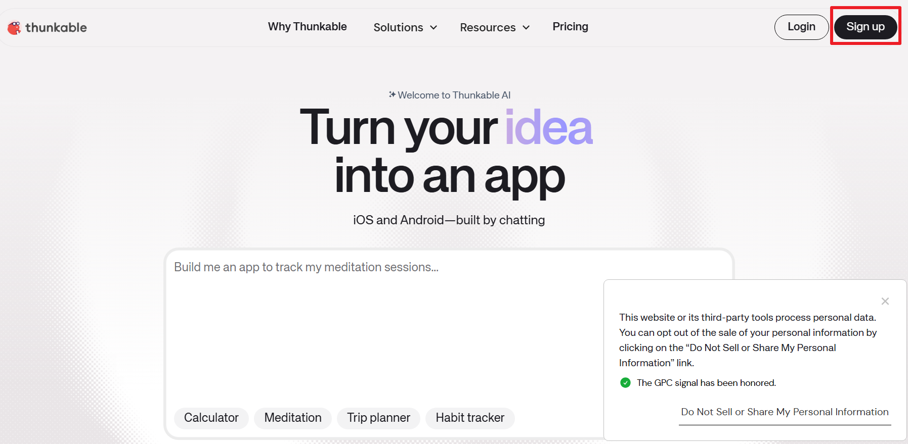

註冊畫面可能提供 Google、Apple 或電子郵件。本頁後面的手機測試依官方文件整理 Google 與電子郵件兩種連線方式，因此建議本練習選擇其中一種。若你已使用 Apple 登入，請先查看官方 Live Test 文件是否已有適用的連線方式；無法確認時可停止手機測試，不影響你閱讀其餘步驟。不要把帳號、密碼或登入郵件記錄在公開專案中。

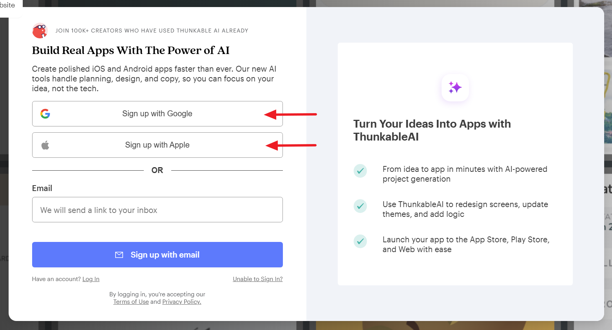

### 2. 從新版首頁進入積木工作區

登入後可能先進入新版 Thunkable AI 首頁。這個畫面不是本頁使用的積木編輯器；選擇左上角的 `Go to x.thunkable.com` 進入有 Design 與 Blocks 的工作區。

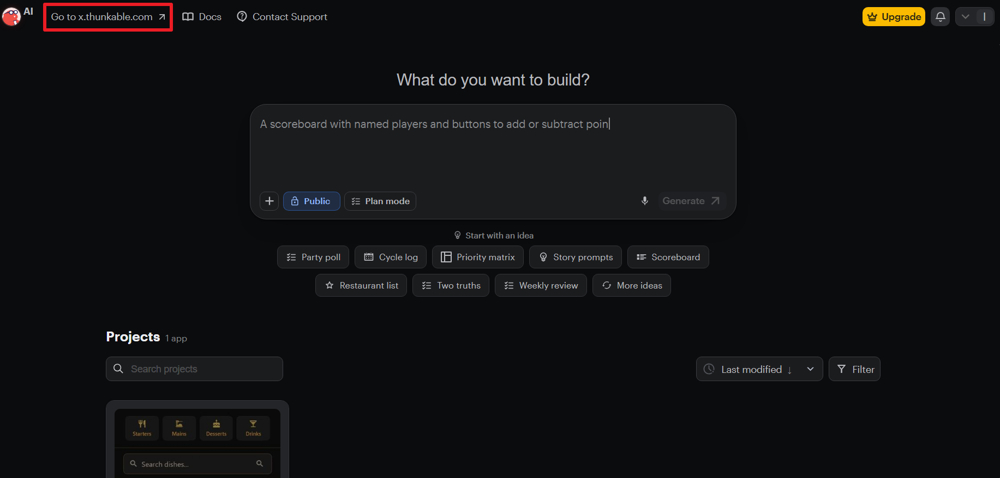

進入工作區後，依序選擇左側的 `My Projects`，再選擇畫面中的 `Create Blank Project`。如果按鈕位置因改版而不同，可先回到 `My Projects` 專案清單尋找建立空白專案的入口；不要使用 AI 產生專案取代本頁的元件與積木步驟。

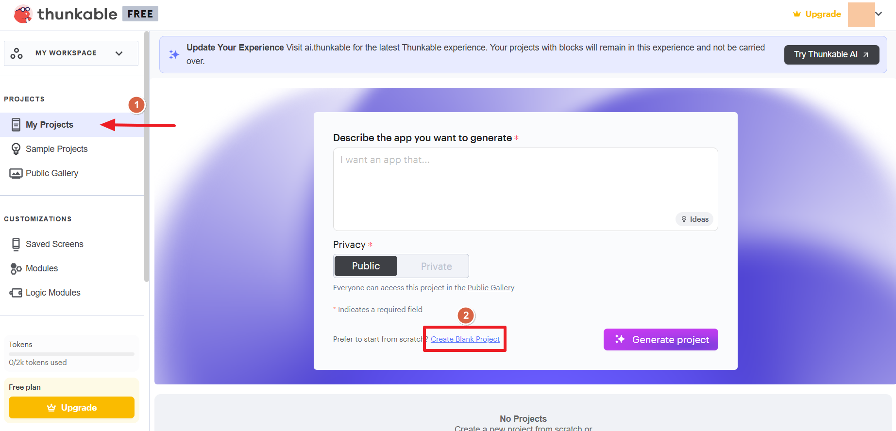

### 3. 建立空白專案

1. Project Name（專案名稱）可填入 `calendar-browser`。
2. 若畫面要求 Category（分類），可選擇適合測試用途的 `Just Testing`。
3. 若只能選擇 Public（公開），再次確認專案中沒有敏感資料。
4. 保持 `Use the Drag and Drop Builder` 已勾選，再選擇 `Create`。

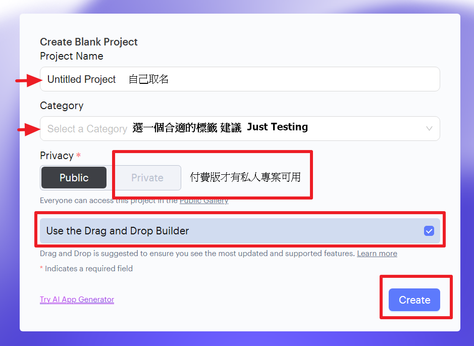

建立完成後，上方應能切換 `Design` 與 `Blocks`。完成時，應能確認你有一個可在 Design 區放入元件、可在 Blocks 區編輯事件的空白專案；若仍停留在文字輸入的 AI 產生頁，請回到上一步進入 `x.thunkable.com`。

## Stage 1：建立 Page 與 Size 介面

先做不連網的介面。這一步只確認 Slider 與 Label 的互動，還不會讀取 API。

### 1. 加入元件並命名

在 Design 區依下表加入元件。畫面排列可自行調整，但請維持相同的元件名稱，後續積木才容易對照。

| 畫面用途 | 元件名稱 | 建議初始文字或設定 |
| --- | --- | --- |
| 顯示目前設定 | `Label_Para` | `Page: 0, Size: 50` |
| 說明頁碼 | `Label_Page1` | `Page` |
| 選擇頁碼 | `Slider_Page` | 最小值 `0`、初始值 `0`、`Step` 設為 `1` |
| 說明每頁筆數 | `Label_Size1` | `Size` |
| 選擇每頁筆數 | `Slider_Size` | 最小值 `1`、最大值 `100`、初始值 `50`、`Step` 設為 `1` |

### 2. 初始化 Slider 範圍

在 Blocks 區建立 App 變數 `TOTAL_DATA_COUNTS`，暫時設為 `2000`。它只是用來推估可選的最大頁碼，**不是** API 保證提供的即時總筆數。

在 `Screen Starts` 建立「元件初始化」函式，完成下列設定：

1. `Slider_Size` 的最小值設為 `1`、最大值設為 `100`、初始值設為 `50`。
2. `Slider_Page` 的最小值與初始值設為 `0`。
3. 先計算 `2000 ÷ 目前 size` 並無條件進位，再減 `1`；也就是 `ceil(2000 ÷ 目前 size) − 1`，將結果設成 `Slider_Page` 的最大值。
4. 呼叫下一步的「更新參數顯示」函式。

當 `Slider_Size` 改變時，也要重新計算 `Slider_Page` 的最大值；若目前頁碼超過新上限，將它調回上限。兩個 Slider 的 `Step` 都設為 `1`，避免把小數送給 API。

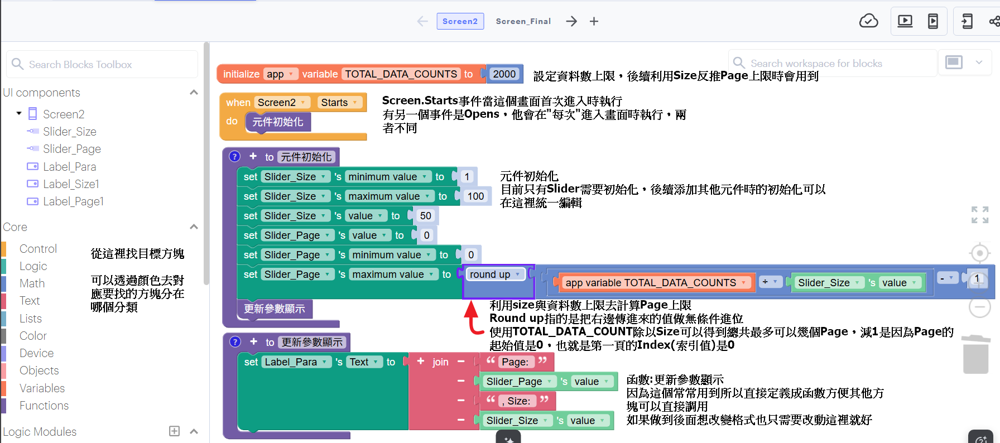

Size Slider 的 Value Change 事件要使用相同的頁碼上限公式，再更新畫面文字。下圖顯示 Size 改變時，先限制 Page 範圍再呼叫更新函式。

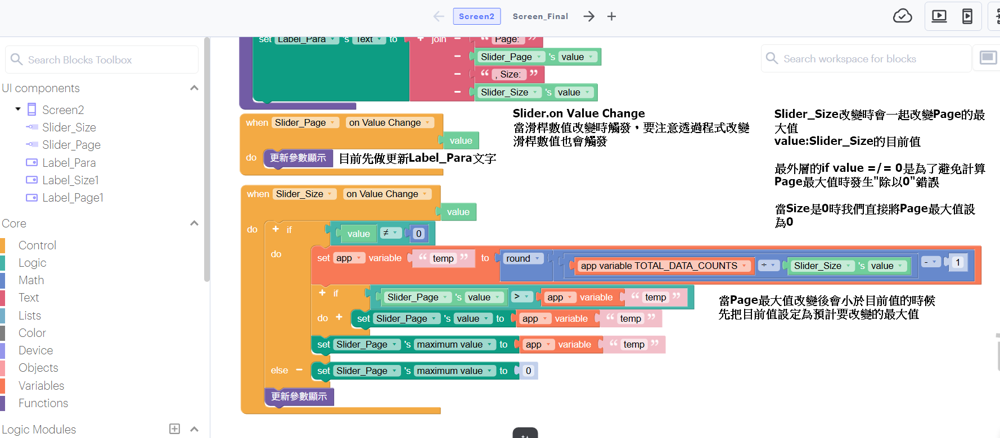

!!! warning "請把圖中的 round 改成 round up"
    原始操作截圖的下拉選項顯示一般的 `round`，實作時請改選 `round up`（無條件進位），讓公式與初始化積木一致：`ceil(TOTAL_DATA_COUNTS ÷ Slider_Size.value) − 1`。若使用一般四捨五入，當總筆數無法被 `size` 整除時，可能會少算最後一頁。

### 3. 顯示目前參數

建立「更新參數顯示」函式，將 `Label_Para` 的文字更新成 `Page: <Slider_Page 的值>, Size: <Slider_Size 的值>`。在兩個 Slider 的 Value Change 事件中呼叫它。

完成時，應能確認移動任一 Slider 後，`Label_Para` 立刻顯示相同的數值。此時畫面仍不會讀取網路資料。

## Stage 2：設定 Web API 並用固定參數讀取

### 1. 加入讀取與顯示元件

在 Design 區再加入下列元件：

| 畫面用途 | 元件名稱 | 建議初始設定 |
| --- | --- | --- |
| 發出要求 | `Button_Call` | 文字：`GET API` |
| 顯示訊息或一筆資料 | `Result_Text`（Rich Text） | 文字：`初始化` |
| 選擇本次清單的一筆 | `Slider_index` | 最小值 `1`、初始值 `1`、`Step` 設為 `1`、先設為停用 |

再到 Blocks 區的 Advanced 加入 Web APIs 元件，命名為 `Web_API1`。建立 App 變數 `api_response`，初始值為 empty list（空清單）。

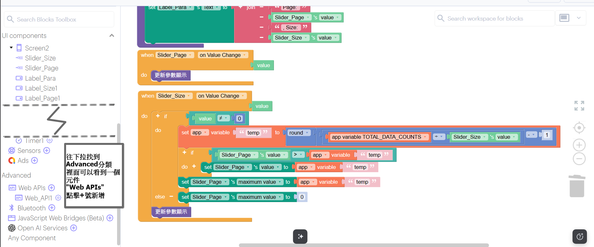

加入按鈕、Rich Text 與資料索引 Slider 後，畫面可先排成下圖的上下順序；元件大小可以依手機畫面調整。

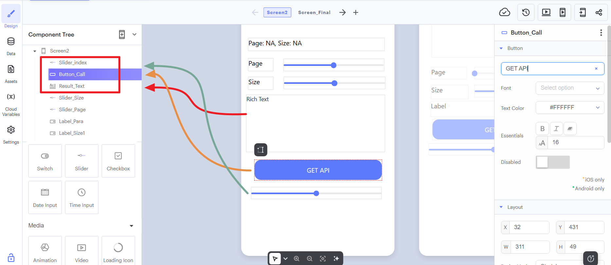

回到初始化函式，將 `Result_Text` 設為「初始化」、按鈕文字設為 `GET API`，再把 `Slider_index` 的最小值、最大值與目前值設為 `1`，`Step` 設為 `1` 並先停用。這能避免 API 尚未回應時讀取不存在的清單項目。

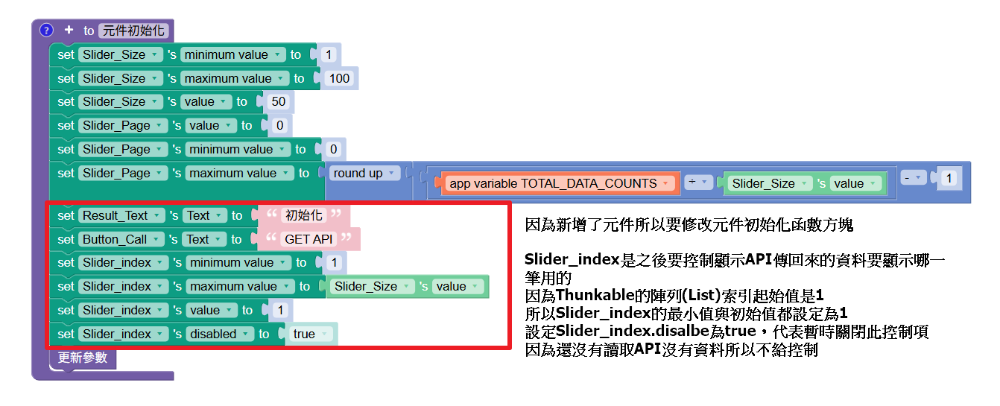

### 2. 設定端點與固定查詢參數

新北市政府資料開放平臺的 API 說明將 `page` 定義為從 `0` 起算的頁碼，`size` 是每頁筆數。先辨認這兩個參數，再回到 Thunkable 設定元件。

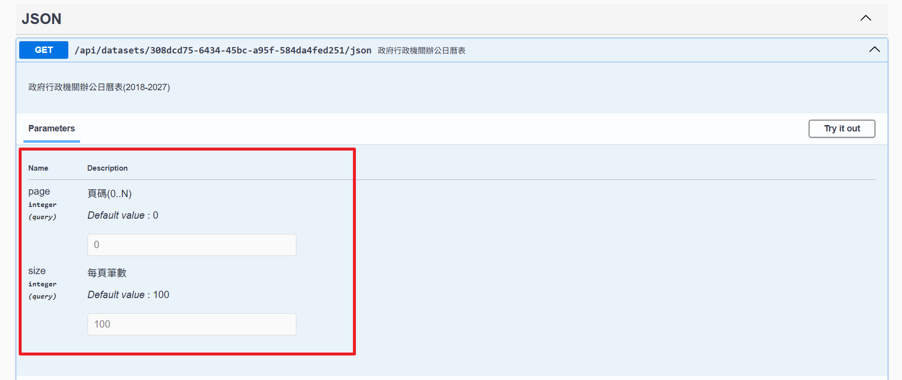

開啟 `Web_API1` 的設定，填入以下內容：

| 欄位 | 值 |
| --- | --- |
| URL | `https://data.ntpc.gov.tw/api/datasets/308dcd75-6434-45bc-a95f-584da4fed251/json` |
| Query Parameters | `page: 0` 與 `size: 100` |
| Headers | `accept: application/json` |

!!! warning "URL 不要包含查詢參數"
    URL 欄位只能填端點本體，**不要**填入 `?page=0&size=100`。`page`、`size` 要分別新增到 Query Parameters。這樣下一個 Stage 才能安全地用 Slider 的值更新它們，且不會出現兩組重複參數。

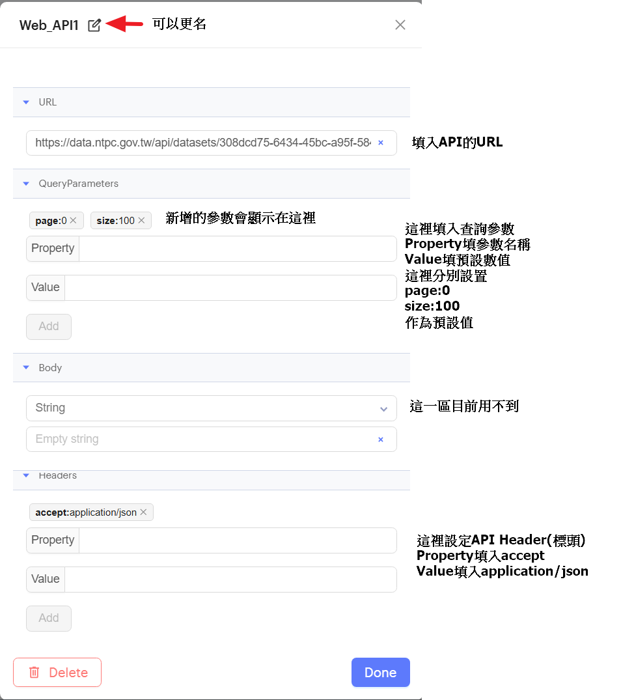

### 3. 先確認固定 GET 能讀到清單

在 `Button_Call Click` 事件中呼叫 `Web_API1 Get`。回傳的 `response`、`status`、`error` 是本次要求的結果；先在沒有 `error` 時，把 `response` 用「get object from JSON」轉成 JSON 清單，保存到 `api_response`，並在 `Result_Text` 顯示 `收到資料，共計：<清單長度> 筆`。

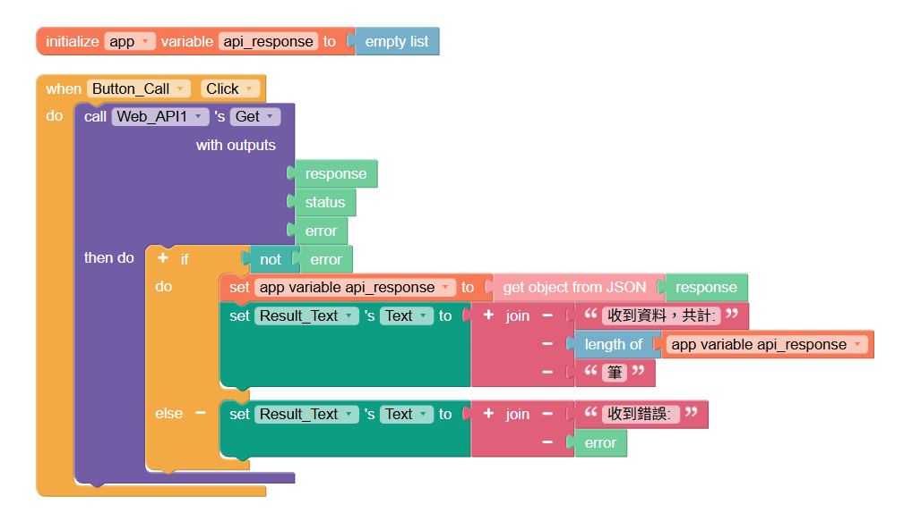

這個 Stage 的 `page: 0`、`size: 100` 是直接寫在 Web API 元件內的固定初始值，尚未與兩個 Slider 連動。因此即使 `Label_Para` 顯示 `Size: 50`，按下按鈕仍會收到 100 筆；這是本階段預期的中間結果。

完成時，應能確認按下按鈕後顯示收到的筆數，並理解它目前來自 Web API 的固定參數。

下圖是這個中間階段的預期結果：畫面 Label 仍顯示 `Size: 50`，但 Web API 使用固定的 `size: 100`，所以收到 100 筆。下一個 Stage 才會把兩者連結。

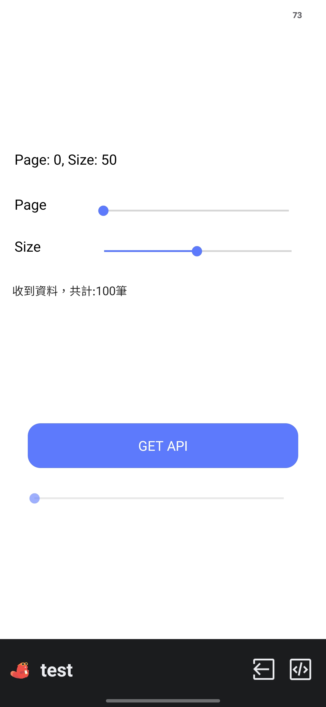

## Stage 3：讓 Slider 更新 Query Parameters

回到 Stage 1 的「更新參數顯示」函式。在更新 `Label_Para` 後，加入「set `Web_API1`'s QueryParameters」積木，使用 create object（建立物件）設定：

| Property | Value |
| --- | --- |
| `page` | `Slider_Page` 的 value |
| `size` | `Slider_Size` 的 value |

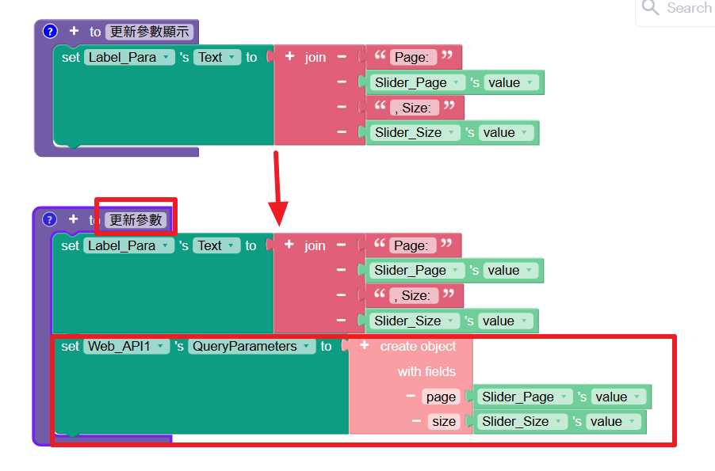

現在移動 Page 或 Size Slider 只是在準備下一次要求；請等畫面不是「讀取中」時，再按 `GET API`。例如設定 `page=0`、`size=50` 後，成功時應收到 50 筆，表示這次回應已使用 Slider 的值。

完成時，應能確認調整 `size` 後重新按 `GET API`，收到的筆數會隨設定改變。

例如畫面設定 `Size: 50` 後收到 50 筆，便能確認這次 Query Parameters 已使用 Slider 的值。

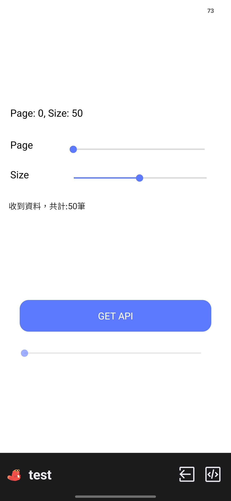

## Stage 4：顯示一筆資料並處理讀取狀態

### 1. 建立「更新讀取結果顯示」函式

建立函式後先判斷 `length of api_response > 0`：

- 有資料時，從 `api_response` 取出 `Slider_index` 指定的那一筆物件，將序號、`name`、`holidaycategory`、`date` 組成 `Result_Text` 的文字。
- 清單是空的時，顯示「讀到的資料清單為空」。

`name` 可能是空白，例如一般週末不一定有特別名稱；空白不代表 API 讀取失敗。`holidaycategory` 與 `date` 的內容也可能隨資料來源更新而改變。

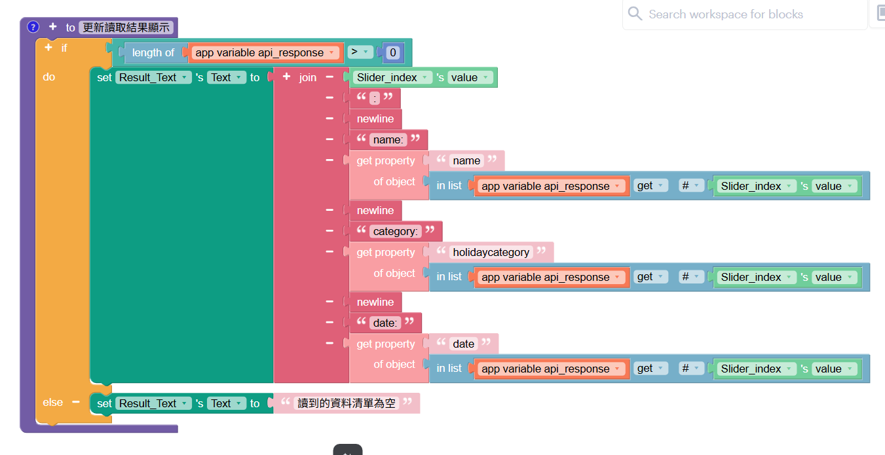

在 `Slider_index Value Change` 事件呼叫這個函式。這個事件不呼叫 `Get`，因此滑動資料索引 Slider 只會切換已收到的清單內容。

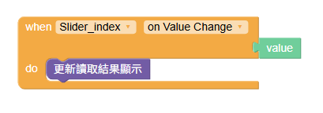

### 2. 在按下按鈕時先清除舊狀態

把 `Button_Call Click` 事件改成下列順序：

1. 停用 `Button_Call` 與 `Slider_index`。
2. 將 `Slider_index` 的最大值與目前值重設為 `1`。
3. 將 `Result_Text` 改為「讀取中...」，並把 `api_response` 設為 empty list。
4. 呼叫 `Web_API1 Get`。

在 `Get` 回呼中先判斷沒有 `error`，再判斷 `status = 200`。只有兩者都成立時，才把 `response` 轉為 JSON 並保存到 `api_response`。若清單有資料，先把 `Slider_index` 的最大值設成實際清單長度並解除停用；接著無論清單是否有資料，都呼叫「更新讀取結果顯示」函式，讓空清單也能顯示對應訊息。

發生 `error` 時，清空清單並顯示 `收到錯誤：<錯誤內容>`；沒有 `error` 但 `status` 不是 `200` 時，顯示 `收到異常狀態碼：<status>`。兩種情況都不要重新啟用資料索引 Slider。回呼結束前重新啟用 `Button_Call`。

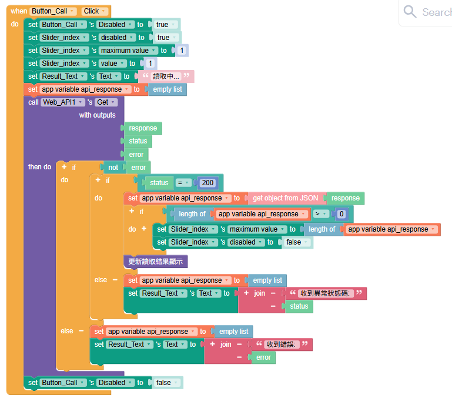

### 3. 用 Thunkable Live 測試

在電腦開啟專案後，依官方[測試步驟](https://docs.thunkable.com/getting-started/live-test)連接 Thunkable Live：

1. 在瀏覽器的專案畫面選擇 `Live Test on Device` 圖示。
2. 在 Android 或 iOS 裝置開啟 Thunkable Live。
3. 若瀏覽器使用 Google 登入，手機也使用同一個 Google 帳號登入。
4. 若瀏覽器使用電子郵件登入，在瀏覽器選擇 `Enter my code`；接著在手機選擇 `Email sign in - Generate test code`，把手機顯示的測試碼輸入瀏覽器並選擇 `Connect`。
5. 在手機的專案清單開啟本頁建立的專案，再測試 Page、Size、`GET API` 與資料索引 Slider。

不要只看電腦預覽畫面就判定網路讀取成功。若官方 App 的按鈕名稱已改變，以官方測試頁目前列出的流程為準。

!!! warning "讀取中不要改參數"
    本練習在讀取期間會停用按鈕與資料索引 Slider，但 Page／Size Slider 仍可移動。`Result_Text` 顯示「讀取中...」時請不要調整 Page 或 Size；先等這次要求結束，再設定下一次要讀取的參數。若手機沒有 Android 或 iOS 裝置可安裝 Thunkable Live，請停止本項選做實作。

完成時，應能確認：

- 在 Thunkable Live 中按下按鈕後，先看到「讀取中...」，舊資料不會留在畫面上。
- 成功且有資料時，資料索引 Slider 的最大值等於本次實際筆數。
- 移動資料索引 Slider 後，Rich Text 顯示該筆的 `name`、`holidaycategory`、`date`，不會重新送出 API 要求。
- 發生錯誤、狀態碼不是 `200` 或收到空清單時，畫面有對應訊息，且無法誤讀前一次資料。

下圖是 Thunkable Live 的成功結果範例。公開資料可能更新，因此你看到的日期、分類與資料索引不必和圖片完全相同；重點是參數、索引與單筆欄位會依操作改變。

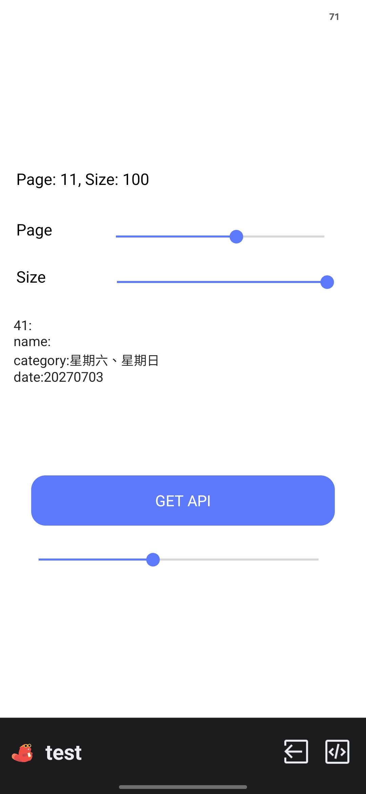

## 常見問題

### Label 顯示 `Size: 50`，卻收到 100 筆

如果你仍在 Stage 2，這是正常結果：Web API 元件還使用固定的 `size: 100`。完成 Stage 3 後，確認「更新參數顯示」函式有把 `Slider_Size` 的 value 寫入 Query Parameters，接著重新按 `GET API`。

### URL 裡已經有 `?page=...&size=...`，還需要 Query Parameters 嗎？

不要同時使用。刪除 URL 中的查詢字串，只在 Query Parameters 保留 `page` 與 `size`。同一個參數出現在兩處時，很難判斷 API 實際使用哪個值。

### 資料索引從 1 開始，為什麼 Page 從 0 開始？

兩者來自不同規則。這個 API 的 `page=0` 代表第一頁；本頁的 Thunkable List 設定則以索引 `1` 代表第一筆資料。不要把 Page Slider 當成資料索引 Slider。

### 滑動資料索引時，`name` 是空白

這筆資料可能沒有提供名稱。請同時查看 `holidaycategory` 與 `date`；只要沒有錯誤訊息，且索引可正常切換，空白 `name` 可以是資料本身的內容。

### Thunkable Live 無法連線或 App 沒有顯示結果

先確認電腦與手機登入的是同一個 Thunkable 帳號，並依官方[測試與疑難排解說明](https://docs.thunkable.com/getting-started/live-test)重新連線。若在可正常連線的 Wi-Fi 下仍長時間無回應，停止這次測試並保留畫面；不要改動 APN，也不要加入 Proxy。

### 為什麼 Page 上限是用 `2000` 算出來的？

`TOTAL_DATA_COUNTS = 2000` 只是本頁測試用的推估上限，不是 API 提供的總筆數。實務上有些 API 不會提供總數；可用 Iterator（迭代器）的概念逐頁讀取，直到收到空清單或本頁筆數少於 `size`。這會增加狀態與停止條件，本頁先不實作。

## 重點整理

- Web API 的 URL 放端點本體；`page`、`size` 放在 Query Parameters。
- `page`、`size` 決定下一次 `GET` 的範圍；資料索引只切換本次已保存的 JSON 清單。
- 按下按鈕時先顯示讀取中並清空舊資料；收到回應後再檢查 `error` 與 `status = 200`。
- 使用 Android 或 iOS 的 Thunkable Live 進行本頁測試；公開專案只放公開資料與可公開的內容。

## 參考資料

- [Thunkable 官方：Preview and Test your App](https://docs.thunkable.com/getting-started/live-test)
- [Thunkable 官方：Thunkable Projects](https://docs.thunkable.com/settings/manage-your-projects/projects)
- [Thunkable 官方：App Settings](https://docs.thunkable.com/settings/project-settings)
- [Thunkable 官方：Web APIs Blocks](https://docs.thunkable.com/blocks/advanced-app-features/web-api)
- [Thunkable 官方：Lists Blocks](https://docs.thunkable.com/blocks/blocks/lists)

## 下一步

可回到[Thunkable：App 與 Web API 的概念](thunkable與web-api概念.md)整理本頁用到的資料流，或回到[前導技術概要](index.md)選擇其他獨立的選做主題。
